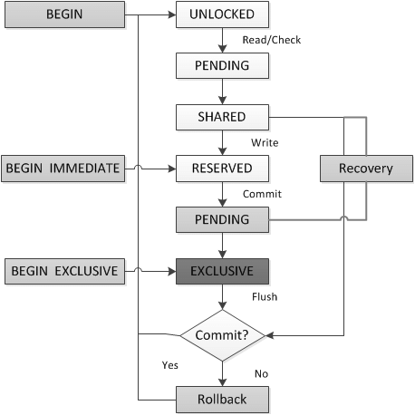

# 数据库文件锁
数据库文件上的几种锁：

①NO_LOCK

②SHARED_LOCK

③RESERVED_LOCK

④EXCLUSIVE_LOCK

⑤UNKNOWN_LOCK

|起始状态 | 目标状态 | 是否引入繁忙处理机制 |
| -- | -- | -- |
| NO_LOCK | SHARED_LOCK | Yes |
| SHARED_LOCK | RESERVED_LOCK | NO |
| SHARED_LOCK | EXCLUSIVE_LOCK | NO |
| RESERVED_LOCK | EXCLUSIVE_LOCK| YES |

 SQlITE有5种锁状态，连接总是处于其中之一。

  每个状态都有一个相应的锁，未锁定除外。
 所有的事务都是从未定锁、保留和排它锁开始的。
数据库写操作，需要经历：未加锁->待定锁->共享锁。

连接尝试向数据库写入内容时，必须从共享锁转换到保留锁。如果它获得保留锁，准备好开始进行数据修改。即使连接真的不能在此时修改数据库，它也可以修改内容存储在
本地pager内的cache_size页面缓存中。当连接进入保留状态时，pager初始化回滚日志。回滚日志是一个文件，用于回滚和故障恢复。它将数据库还原到事务开始之前的原来状态的数据库页。当B-tree修改页时，pager将这些数据库页都存放到日志文件。
 对update修改的每条记录，页面获取与原始记录相关的数据库页，并将它们复制到日志中。日志就拥有事务开始之
前的一些数据库内容。因此，要撤销事务时，pager只是
 简单地将日志文件中的内容复制会数据库中。
 

