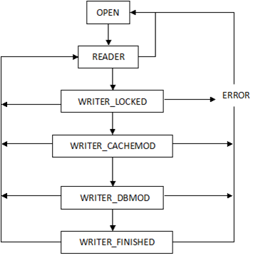
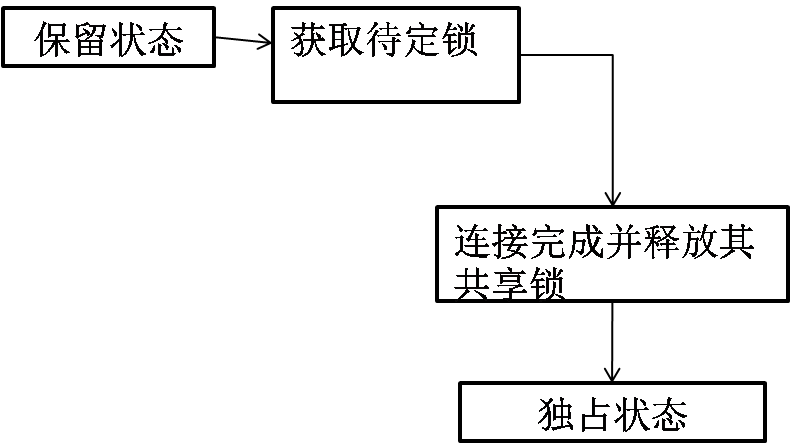

# Pager的状态

状态转化示意图如下：

<table>
<tr><td>状态转换</td><td>调用函数</td></tr>
<tr><td>OPEN->READER</td><td>[sqlite3PagerSharedLock]</td></tr>
<tr><td>READER->OPEN</td><td>[pager_unlock]</td></tr>
<tr><td>READER->WRITER_LOCKED</td><td>[sqlite3PagerBegin]</td></tr>
<tr><td>WRITER_LOCKED->WRITER_CACHEMOD</td><td>[pager_open_journal]</td></tr>
<tr><td>WRITER_CACHEMOD-> WRITER_DBMOD</td><td>[syncJournal]</td></tr> <tr><td>WRITER_DBMOD-> WRITER_FINISHED </td><td>[sqlite3PagerCommitPhaseOne]</td></tr>
<tr><td>WRITER_***-> READER</td><td> [pager_end_transaction]</td></tr>
<tr><td>WRITER_***-> ERROR</td><td>[pager_error]</td></tr>
<tr><td>ERROR->OPEN</td><td>[pager_unlock]</td></tr> </table>

保留状态下，pager实际上管理三种页：已修改页、未修改页
和日志页。已修改页时包含B-tree已改变记录的页，这些
页存储在页缓存中。末修改页是B-tree读取但并未改变的页。日志页，就是修改页的原始版本，它不会存储在页面缓存中，但B-tree修改前会将其写入日志。

待定状态下，pager试图从保留状态获取待定锁。写操作保证它可以排队等待数据库，最终都可以获得独占锁。待定状态下，写操作等待这些连接完成并释放其共享锁。然后，pager从待定状态转换到独占状态。
独占状态下，将修改的页从页面缓存刷新到数据库文件，pager开始修改数据库。

 pager在写入修改页面之前，首先处理日志。它检查日志
 的完整内容是否已写入磁盘。在继续处理之前，pager执
 行两次同步操作，确保将日志提交到磁盘。处理完日志，pager就将所有已修改的页复制到数据库文件中。事务提交后，pager清理日志，清除页缓存，从独占模式回到未锁定状态。如果未提交，pager继续持有独占锁，日志继续发挥作用，直到发出commit或者rollback命令。

