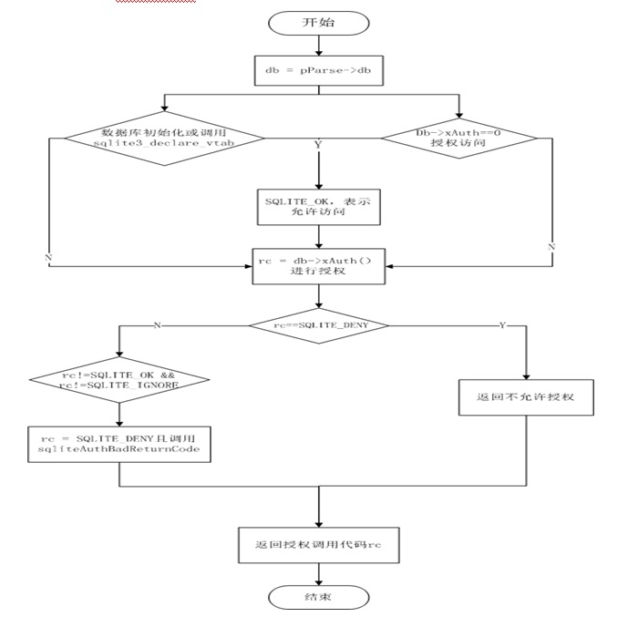

# 使用给定的代码和参数的授权检查
函数说明
<pre>
int sqlite3AuthCheck(
  Parse *pParse,
  int code,
  const char *zArg1,
  const char *zArg2,
  const char *zArg3
)</pre>

工作流程

（1）如果db->init.busy 或IN_DECLARE_VTAB（从sqlite3_declare_vtab内部调用）和db->xAuth==0保持返回SQLITE_OK，将给出的参数放到rc = db->xAuth(db->pAuthArg, code, zArg1, zArg2, zArg3, pParse->zAuthContext)中进行授权验证。

（2）如果rc==SQLITE_DENY，错误类型将不被授权，错误数和错误pParse里适当修改的消息。

（3）反之如果rc!=SQLITE_OK && rc!=SQLITE_IGNORE保持，则返回一个授权错误信息（非法值）

如图为AuthCheck函数实现流程

