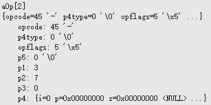

# OP_If
下图是OP_If的内容:


```
case OP_If: {
	int c;
  	pIn1 = &aMem[pOp->p1];
	c = sqlite3VdbeRealValue(pIn1)!=0.0;//c为1
 	if( c ){
    		pc = pOp->p2-1;
  	}
}
```
OP_If操作符在&aMem[pOp->p1]不为0的情况下会返回p2的值给pc，让下一个操作符由p2决定，但是由于  &aMem[pOp->p1]的值为0，经过sqlite3VdbeRealValue函数转化为浮点数后还是0.0，所以if判断为假不执行。pc在for循环后加1，为3，下一个要执行的是aOp[3] OP_Integer。
