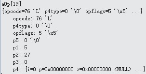

# OP_IsNull
下图是OP_IsNull的内容:

 
 ```
case OP_IsNull : {
	pIn1 = &aMem[pOp->p1];
	if( (pIn1->flags & MEM_Null)!=0 ){//条件为假
   		 pc = pOp->p2 - 1;
 	 }
}
```

如果p1为NULL，就跳转到p2指向的操作符，这里p1为5，所以不用跳转。pc加1为20，下一个要执行的是  aOp[20] OP_String。
