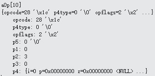

# OP_Null
下图是OP_Null的内容:

 
 ```
 case OP_Null : {
	 int cnt;
	 cnt = pOp->p3 - pOp->p2; //cnt=-3
	while( cnt>0 ){
	….}
}
```

OP_Null操作符是要在p3>p2的前提下在p2中写入NULL， p3也写入NULL。由于cnt=-3，所以不执行。pc加1为11，下一个要执行的是aOp[10] OP_Insert。
