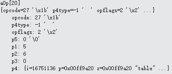

# OP_String
下图是OP_String的内容:

 
 ```
case OP_String : {
	 pOut->flags = MEM_Str|MEM_Static|MEM_Term;
  	pOut->z = pOp->p4.z;
  	pOut->n = pOp->p1;
  	pOut->enc = encoding;
}```

OP_String操作符把p4中存放的字符串“table”和存放p4长度5的p1都放在p2指向的内存中。pc加1为21， 下一个要执行的是aOp[21] OP_String。
