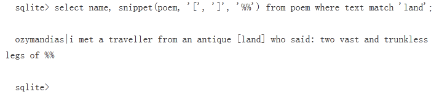

# 索引的搜索

 由前面的叙述，我们移动能很肯定的说找到了“想要的文档”了吗？事情到这里实际上并没有结束，对全文检索来说，“找到了”只是标识检索效果的一个必要条件。在文档集合很大的情况下，一个简单地查找字符串，会返回很多的文档，难道为了找到真正想要的文件，而去一个一个打开去看吗？那如果是这样，那么费劲的建索引，就显得没什么意义了。因为，用户最多会查看几个文档，如果还没有找到，用户会选择直接放弃，虽然，真正想找的文件实际上在结果集中，只是它并不是在最前面而已。所以对文档按照相关度排序是全文检索的另一个必要条件。如何从这么多结果中，选出最相关的放在最前面。也就是如何判断搜索出的文档和查询语句的相关性。

## 7.1搜索的几个主要步骤


（1）：输入查询语句：这里将输入的语句称为一个query，也就是我们平常说话的语言。我们知道说的话是有一定语法的，除了自然语言以外，还有很多人工的语言，例如SQL，编程语言，二进制代码。每种语言都有他自己的一套语法，例如常用的编程语言C语言，就规定了C语言的一套语法，除了个语言特定的语法以外，还有像"AND","OR","NOT"等这些逻辑判断的基本语法。

（2）：对语句进行词法、语法分析及语言处理。对查询语句这一系列处理都是基于他自身的语法结构进行分析，用此法分析器分析出单词和关键字，用语法分析器来生成语法树。

（3）：在索引中进行检索，并返回与查询语句语法树相符合的文档。具体步骤如下：

①首先，在反向索引表中，分别找出包含输入的Term项的文档链表

②其次，对包含以上Term项的链表进行合并

③然后，将此链表与另一个Term的文档链表进行差操作，去除包含另一个Term的文档。从而得到既包含这些Term项而不包含另一个Term项的文档链表。最后根据得到的文档和查询语句的相关性，就可以得到按照文档相关度排序的结果集了。

虽然通过上面的步骤，得到了想要的文档，因为我们是按文档相关度来排序结果的，当然就知道排在前面的肯定是跟查询语句最相关的文档了，也就是根据相关度，把用户最可能想到的文档，放在了最前面。那么，关键问题又来了，这个相关度是怎么九三得来的呢?首先我们可以看到一个文档由很多词组成，其次杜宇文档之间的关系，不同的Term重要性不同，所以如果两篇文档都包含了对各自文档来说比较重要的词，那么这两篇文档的相关性就会好一些，因为判断文档之间的关联关系，首先应找出对文档关系起重要作用那个的词，然后判断这些词和查询语句中词的相关联程度。
一个词定义文档的重要程度依赖于两个参数Term和Document。词的权重指示了该词对于这篇文档的照耀程度，词的权重越大就说明该词对于这篇文档越重要。向量空间模型算法被用于判断词之间的关系从而得到文档相关性。这里就不介绍这个算法的详细过程了，不过这里可以给出计算的公式：
  

其中  表示词在文档中的权重， 表示词t在文档d中出现的频率，n表示文档的总数，   

 表示包含词t的文档的个数。


## 7.2搜索的主要函数实现

（1）输入查询语句：查询语句通过parseQuery函数，被解析并保存为一个Query，Query的定义如下
```
typedef struct Query {
  fulltext_vtab *pFts;  		
  int nTerms;           	/*条款数量的查询*/
  QueryTerm *pTerms;    	/*条款的数组。动态分配空间*/
  int nextIsOr;      		/*将isOr标志设置在下个一个插入的条款中*/
  int nextColumn;       	/*下一个字必须在本列中解析*/
  int dfltColumn;      	/*默认的列*/
} Query;
```

在每一个QueryTerm中，都保存有对应的项的文本及字节数等信息 
（2）在索引中进行检索，并返回与Query中的项相匹配的文档fulltextQuery函数用来执行全文查询。它的函数头如下：
```
static int fulltextQuery(
  fulltext_vtab *v,      	/* 全文索引 */
  int iColumn,           	
  const char *zInput,    	/* 查询字符串 */
  int nInput,            	/* 在zInput[]中的字节数 */
  DocList **pResult,     	/* 这里用doclist保存查询结果 */
  Query *pQuery        	/* 用于解析查询字符串zInput */
)
```

（3）查询结果的特殊显示 
	FTS1可以使用snippet函数创建一个片段（Snippet）结构，用来保存查询到的含有匹配词的文档片段，并且在输出时将匹配词标记显示。例如： 
 
在这个例子中我们在查询中使用snippet函数，在搜索结果中可以看出，匹配词“land”使用<b></b>标记出来，不存在匹配词的部分使用省略符号表示。
片段（Snippet）定义如下所示： 
```
typedef struct Snippet {
  int nMatch;     	/*匹配的总数*/
  int nAlloc;     		/* Space allocated for aMatch[] */
  struct snippetMatch { 	/*每个匹配的条款的条目*/
    char snStatus;       	/*构建片段时使用状态标记*/
    short int iCol;      	/*包含匹配的列*/
    short int iTerm;     	/*匹配词在Query.pTerms[]中的索引*/
    short int nByte;     	/*条款中的字节数*/
    int iStart;          	/*条款中第一个字符的偏移*/
  } *aMatch;      		/*指出空间分配获得的空间*/
  char *zOffset;    		/* aMatch[]的文本呈现*/
  int nOffset;    	  		/*对zOffset计数*/
  char *zSnippet;  		/*Snippet文本*/
  int nSnippet;   			/*对zSnippet计数*/
} Snippet;
```

其中snippetMatch数组用来保存每一个匹配项的相关信息
snippetText函数用来生成一个片段的文本，并且可以设定标记符号和省略符号。它的函数头如下所示
如下是一个自定义标记符号的例子： 
```
static void snippetText(
  fulltext_cursor *pCursor,   	/* 我们要使用的片段所在的游标 */
  const char *zStartMark,     	/* 每个匹配词之前的标记 */
  const char *zEndMark,       	/* 每个匹配词之后的标记 */
  const char *zEllipsis       	/* 省略标记 */
)
```

snippet函数的实现则由snippetFunc函数完成，它在函数体中调用snippetText函数，并且完成片段的输出。如下是一个自定义标记符号的例子： 




