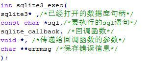
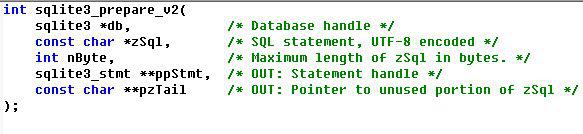
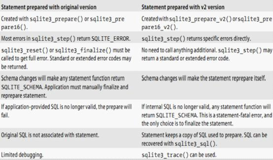
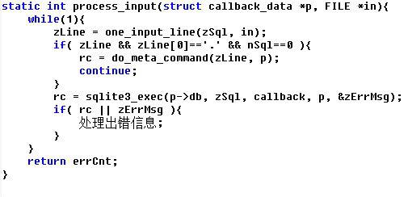
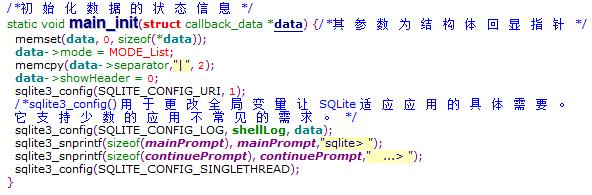
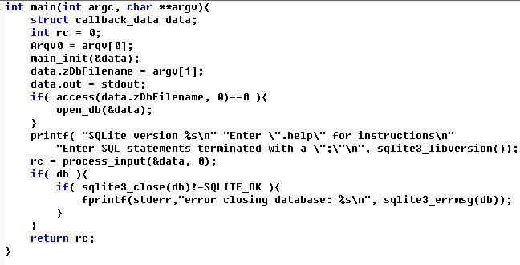

# 重要的API函数
&nbsp;&nbsp;&nbsp;&nbsp;&nbsp;&nbsp;在Sqlite数据库中，可由程序直接调用相应的API函数去实现对数据的存取操作，SQLite 3.0一共有83个API函数,此外还有一些数据结构和预定义(#defines)。
1）打开数据库，如果不存在则自动创建

2）关闭数据库

3）执行SQL

&nbsp;&nbsp;&nbsp;&nbsp;&nbsp;&nbsp;第1个参数是前面open函数得到的指针；第2个参数const char \*sql 是一条 sql 语句，以“\0”结尾；第3个参数sqlite3_callback 是回调；第4个参数void \* 是所提供的指针，可以传递任何一个指针参数到这里，这个参数最终会传到回调函数里面，如果不需要传递指针给回调函数，可以填NULL。 
&nbsp;&nbsp;&nbsp;&nbsp;&nbsp;&nbsp;sqlite3_callback 和它后面的 void * 这两个位置都可以填 NULL。填NULL表示你不需要回调。比如做 insert 操作，做 delete 操作，就没有必要使用回调。而当做 select 时，就要使用回调，因为 sqlite3 把数据查出来，得通过回调告诉查出了什么数据。 
&nbsp;&nbsp;&nbsp;&nbsp;&nbsp;&nbsp;该函数执行一条或者多条SQL语句，SQL语句之间用“；”隔开，查询结果返回给回调函数；所有的语句执行完毕则返回0，否则说明该执行并没有执行完成功，此时，可以通过第五个参数查看详细的错误信息。在SQLite3里,sqlite3_exec一般是被准备SQL语句接口封装起来使用的。 

4）回调函数 

&nbsp;&nbsp;&nbsp;&nbsp;&nbsp;&nbsp;参数格式: 
&nbsp;&nbsp;&nbsp;&nbsp;&nbsp;&nbsp;传给sqlite3_exec的回调函数,用来显示查询结果,
对每一条查询结果调用一次该回调函数 
&nbsp;&nbsp;&nbsp;&nbsp;&nbsp;&nbsp;参数: 
&nbsp;&nbsp;&nbsp;&nbsp;&nbsp;&nbsp;pv:由sqlite3_exec传递的初始化参数 
&nbsp;&nbsp;&nbsp;&nbsp;&nbsp;&nbsp;argc:表头的列数 
&nbsp;&nbsp;&nbsp;&nbsp;&nbsp;&nbsp;col:表头的名字数组指针 
&nbsp;&nbsp;&nbsp;&nbsp;&nbsp;&nbsp;argv:表头的数据数组指针 
&nbsp;&nbsp;&nbsp;&nbsp;&nbsp;&nbsp;返回值: 
&nbsp;&nbsp;&nbsp;&nbsp;&nbsp;&nbsp;1:中断查找 
&nbsp;&nbsp;&nbsp;&nbsp;&nbsp;&nbsp;0:继续列举查询到的数据 
&nbsp;&nbsp;&nbsp;&nbsp;&nbsp;&nbsp;在shell.c中，shell\_exec()中会有一个回调函数shell_callback()

    static int shell_callback(void *pArg, int nArg, char **azArg, char **azCol, int *aiType)

&nbsp;&nbsp;&nbsp;&nbsp;&nbsp;&nbsp;回调函数shell_callback()去生成显示方式不同的结果，通过switch( p->mode )语句，判断调用的模式，根据调用的模式不同，选择不同的显示方式，输出不同结果。
在Shell中的查询操作同样是调用SQLite提供的预查询API。

5）执行准备，存放statement句柄

    int sqlite3_prepare(sqlite3*, const char*, int, sqlite3_stmt**, const char**);
&nbsp;&nbsp;&nbsp;&nbsp;&nbsp;&nbsp;sqlite3_prepare()接口把一条SQL语句编译成字节码留给后面的执行函数，使用该接口访问数据库是当前比较好的的一种方法。sqlite3_prepare() 处理的SQL语句应该是UTF-8编码的。输入的参数中只有第一个SQL语句会被编译。第四个参数则用来指向输入参数中下一个需要编译的SQL语句存放的SQLite statement对象的指针。

&nbsp;&nbsp;&nbsp;&nbsp;&nbsp;&nbsp;执行SQL查询时，程序必须首先被该函数编译成一个字节代码，才能被执行。 
&nbsp;&nbsp;&nbsp;&nbsp;&nbsp;&nbsp;"db",从之前成功调用sqlite3_open()，sqlite3_open_v2()或sqlite3_open16()时获得的一个数据库连接。而且数据库连接不能被关闭。 
&nbsp;&nbsp;&nbsp;&nbsp;&nbsp;&nbsp;"zSql",指向将被编译的语句，编码为UTF-8或UTF-16。 
&nbsp;&nbsp;&nbsp;&nbsp;&nbsp;&nbsp;"nbyte",参数小于零，则zSql被读取到第一个零终止;如果nByte是非负的，那么它是从zSql读到的最大字节数。 
&nbsp;&nbsp;&nbsp;&nbsp;&nbsp;&nbsp;"\*ppStmt",指向可以使用sqlite3\_step执行的编译预处理语句。如果有错误，* ppStmt被设置为NULL。调用程序负责删除使用sqlite3_finalize()编译的SQL语句。 
&nbsp;&nbsp;&nbsp;&nbsp;&nbsp;&nbsp;如果成功，将sqlite3\_prepare()函数将返回SQLITE_OK;否则将返回错误代码。
sqlite3\_prepare() 和sqlite3\_prepare_v2()的对比

6）sqlite3_step()方法 
&nbsp;&nbsp;&nbsp;&nbsp;&nbsp;&nbsp;在SQL声明准备好之后, 需要调用以下的方法来执行

    int sqlite3\_step(sqlite3_stmt*);
&nbsp;&nbsp;&nbsp;&nbsp;&nbsp;&nbsp;sqlite3\_prepare函数将SQL命令字符串解析并转换为一系列的命令字节码，这些字节码最终被传送到SQlite3的虚拟数据库引擎（VDBE: Virtual Database Engine）中执行，完成这项工作的是sqlite3_step函数。 
&nbsp;&nbsp;&nbsp;&nbsp;&nbsp;&nbsp;如果SQL返回了一个单行结果集，sqlite3\_step() 函数将返回 SQLITE\_ROW，如果SQL语句执行成功或者正常将返回 SQLITE\_DONE，否则将返回错误代码。 如果不能打开数据库文件则会返回 SQLITE\_BUSY。如果函数的返回值是 SQLITE\_ROW，那么可以使用几个 sqlite3\_column_***() 函数来获得记录集行中的数据。 
&nbsp;&nbsp;&nbsp;&nbsp;&nbsp;&nbsp;Shell.c中用到的有：

    int sqlite3\_column_count(sqlite3_stmt*);
&nbsp;&nbsp;&nbsp;&nbsp;&nbsp;&nbsp;该函数返回结果集中包含的列数。可以在执行了sqlite3_prepare()之后的任何时刻调用。

    int sqlite3\_column_bytes(sqlite3_stmt*, int iCol);
    const void \*sqlite3_column_blob(sqlite3_stmt*, int iCol);
    const char \*sqlite3_column_name(sqlite3_stmt*, int iCol);
    const unsigned char *sqlite3_column_text(sqlite3_stmt*, int iCol);
&nbsp;&nbsp;&nbsp;&nbsp;&nbsp;&nbsp;所有的这些函数都把列的编号作为第二个参数。列编号从左到右以零起始。

    int sqlite3_column_type(sqlite3_stmt*, int iCol);
该函数返回第N列的值的数据类型. 具体的返回值如下：

    #define SQLITE_INTEGER  1
    #define SQLITE_FLOAT    2
    #define SQLITE_TEXT     3
    #define SQLITE_BLOB     4
    #define SQLITE_NULL     5
&nbsp;&nbsp;&nbsp;&nbsp;&nbsp;&nbsp;不一定非要按照sqlite3_column_type()接口返回的数据类型来获取数据。数据类型不同时软件将自动转换。

    sqlite3_column_name()
&nbsp;&nbsp;&nbsp;&nbsp;&nbsp;&nbsp;返回第N列的字段名。sqlite3_column_bytes() 用来返回UTF-8编码的BLOBs列的字节数或者TEXT字符串的字节数。   sqlite3_column_blob() 返回BLOB数据。
sqlite3_column_text() 返回 UTF-8 编码的 TEXT 数据。

7）sqlite3_backup_XXX()

    sqlite3_backup_init()被调用一次初始化备用；
    sqlite3_backup_step()被调用一次或多次，用以在两个数据库之间传输数据；
    sqlite3_backup_finish()被调用以释放与备份操作相关联的所有资源。
&nbsp;&nbsp;&nbsp;&nbsp;&nbsp;&nbsp;当sqlite3_backup_step()返回SQLITE_DONE时，或当应用程序希望放弃备份操作时，应用程序应该通过调用sqlite3_backup_finish来销毁sqlite3_backup()的操作。调用sqlite3_backup_finish()将会释放与sqlite3_backup对象相关联的所有资源。 
&nbsp;&nbsp;&nbsp;&nbsp;&nbsp;&nbsp;如果sqlite3_backup_step()尚未返回SQLITE_DONE，则在目标数据库上的任何写事务操作都将回滚。 
&nbsp;&nbsp;&nbsp;&nbsp;&nbsp;&nbsp;sqlite3_backup_step(B,N)将在源数据库和由sqlite3_backup对象B指定的目的数据库之间复制N个页面。如果N为负数，则所有剩余的页面都将被复制。 
&nbsp;&nbsp;&nbsp;&nbsp;&nbsp;&nbsp;如果sqlite3_backup_step(B,N)成功复制N个页面，并且还有更多的页面将被复制，则该函数返回SQLITE_OK。 
&nbsp;&nbsp;&nbsp;&nbsp;&nbsp;&nbsp;如果sqlite3\_backup_step(B,N)成功完成所有页面的复制操作，则返回SQLITE_DONE。 
&nbsp;&nbsp;&nbsp;&nbsp;&nbsp;&nbsp;如果在运行sqlite3_backup_step(B,N)发生了错误，则错误代码被返回。 
&nbsp;&nbsp;&nbsp;&nbsp;&nbsp;&nbsp;除了SQLITE_OK和SQLITE_DONE，调用sqlite3_backup_step()还可能返回SQLITE_NOMEM，SQLITE_BUSY，SQLITE_LOCKED或SQLITE_IOERR_XXX扩展错误代码。 
&nbsp;&nbsp;&nbsp;&nbsp;&nbsp;&nbsp;另外sqlite3_backup_step()还可能返回SQLITE_READONLY，改代码表示目标数据库是只读方式打开；或者目标数据库使用WAL日志并且目的页面和源页面大小不同；或者目标数据库是一个IMDB内存数据库并且目标和源页面大小不同。具体错误代码的意义在后面也会总结一些。 

8）dump_callback() 
&nbsp;&nbsp;&nbsp;&nbsp;&nbsp;&nbsp;用于转储数据库的回调程序。它返回的每一个结果都包括表名、表类型（索引或者表）、创建表的SQL语句。根据这些信息我们可以重建这些表。 
&nbsp;&nbsp;&nbsp;&nbsp;&nbsp;&nbsp;实现过程需要之前定义过的appendText函数，主要用于查询记录的拼接。

9）sqlite3_finalize() 
&nbsp;&nbsp;&nbsp;&nbsp;&nbsp;&nbsp;任何时候如果调用 sqlite3_finalize() 将销毁一个准备好的SQL声明。在数据库关闭之前，所有准备好的声明都必须被释放销毁。

    int sqlite3_finalize(sqlite3_stmt*);
&nbsp;&nbsp;&nbsp;&nbsp;&nbsp;&nbsp;查询执行流程图：
 
10）process_input() 
&nbsp;&nbsp;&nbsp;&nbsp;&nbsp;&nbsp;循环处理SQL命令的工作是由process_input()函数完成的。该函数还完成“.”命令的处理。 
&nbsp;&nbsp;&nbsp;&nbsp;&nbsp;&nbsp;简化后的process_input()函数如下：

&nbsp;&nbsp;&nbsp;&nbsp;&nbsp;&nbsp;从 \*in 中读取输入并处理。 
&nbsp;&nbsp;&nbsp;&nbsp;&nbsp;&nbsp;如果 *in==0，则发生交互,用户键入内容。否则尝试从一个文件或设备输入。只有当输入是交互式的，发出的提示和历史记录才会被保存。除非输入是交互式的，否则一个中断信号将导致该程序立即退出。 
&nbsp;&nbsp;&nbsp;&nbsp;&nbsp;&nbsp;同时该函数返回的是错误信息的数量。

11）main()函数 
该函数主要完成以下功能： 
&nbsp;&nbsp;&nbsp;&nbsp;&nbsp;&nbsp;①　对callback_data对象进行初始化，主要通过main_init(&data)函数，进行一些默认的设置； 
&nbsp;&nbsp;&nbsp;&nbsp;&nbsp;&nbsp;②　对命令行参数进行初步处理，主要是确定数据库文件位置、初始化文件位置，确定内存分配大小； 
&nbsp;&nbsp;&nbsp;&nbsp;&nbsp;&nbsp;③　读取数据库文件，如果数据库文件后面存在一条命令，进行存储； 
&nbsp;&nbsp;&nbsp;&nbsp;&nbsp;&nbsp;④　再次遍历命令行参数，对命令行选项进行处理，如果数据库文件后存在命令,执行然后结束； 
&nbsp;&nbsp;&nbsp;&nbsp;&nbsp;&nbsp;⑤　如果数据库文件后面不存在命令，则进入shell模式，调用process_input(&data,stdin)来处理shell模式下输入的命令或SQL语句。 
&nbsp;&nbsp;&nbsp;&nbsp;&nbsp;&nbsp;初始化状态信息的main_init()函数：

&nbsp;&nbsp;&nbsp;&nbsp;&nbsp;&nbsp;简化之后的main函数：

&nbsp;&nbsp;&nbsp;&nbsp;&nbsp;&nbsp;main函数的工作流程：

12）Shell.c中重要的结构体

    struct previous_mode_data {  // 定义了结构体，该结构体的作用是在.explain命令执行之前的模式信息
      int valid;     /* Is there legit data in here? */
      int mode;                       //输出模式
      int showHeader;                //显示列名
      int colWidth[100];             //所需列宽
    };
