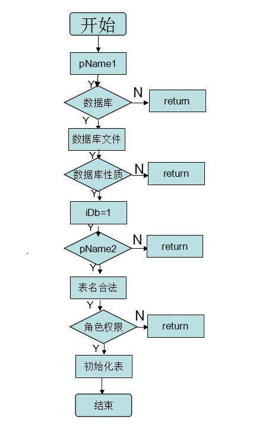
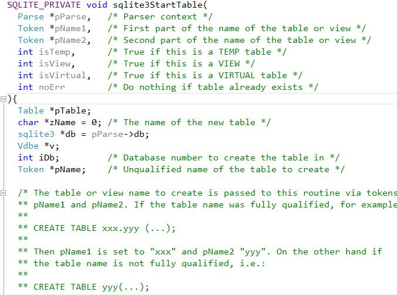
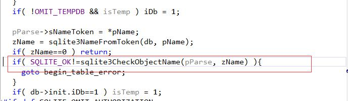
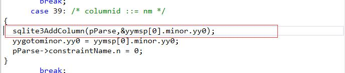
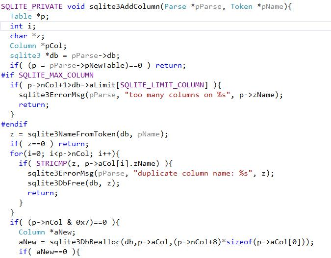
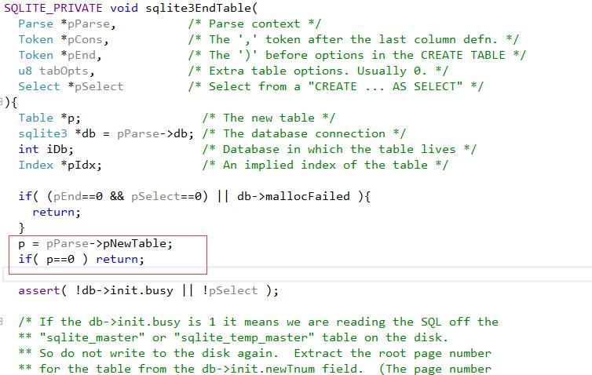

# 表的创建
void sqlite3StartTable(

Parse *pParse, /*解析上下文*/

Token *pName1, /*视图或表名称的第一部分*/

Token *pName2, /*视图或表名称的第二部分*/

int isTemp, /*如果这是一个TEMP表则true*/

int isView, /*如果这是一个视图则true*/

int isVirtual, /*如果是一个虚表则true*/

int noErr /*如果表已经存在，什么也不做*/

)

表在创建之前需要进行一系列机制的检查。
步骤如下：

（1）通过pName1找到数据库的索引，然后判断数据库是否存在，是否是临时的；

（2）通过pName2(表名)检查数据库中的表名是否合法，不合法返回，合法检查数据库中的角色是否有创建数据表的权限，有权限，就创建表。

（3）检查表/索引是否唯一，然后分配内存。这些内存是Table结构体的内存。

（4）对结构体进行初始化，如写表名、主键等。

流程图如图1-2所示。

以上的这些操作是在sqlite_master表中进行操作的，只加了一个占位符，不创建任何记录。真正的执行操的创建是在执行sqliteEndTable()后生成的，这样进行以后就会生成创建表的代码。
上面所进行的的操作是将创建表的框架搭建好，相当于将进行了create table{}操作。
检查机制进行完之后的操作如下所示：
添加列的约束机制，检查是否可以为空，然后添加列属性，但是在添加列的时候要进行其他的约束机制的检查，如列的总数是否达到最大值，列名是否有重名的。用到的函数有sqlite3NameFromToken(db,pName)和宏STRICMP(）,宏的作用是比较两个字符串，不区分大小。然后使用函数sqlite3DbRealloc（）分配内存。

&nbsp;&nbsp;&nbsp;&nbsp;&nbsp;&nbsp;对新增加的一列进行默认操作，使用p->nCol++对列的总数进行修改（+1）。接着使用函数进行为空检查。使用函数sqlite3AddColumnType(Parse *pParse, Token *pType)

对新增加的一列添加属性，在使用函数sqlite3AddDefaultValue(Parse *pParse, ExprSpan *pSpan)添加默认值。通过函数void sqlite3AddPrimaryKey(

    Parse *pParse,
    ExprList *pList,
    int onError,
    int autoInc,     )

添加主键。接着进行创造check约束。函数如下：

void sqlite3AddCheckConstraint(
    Parse *pParse,
Expr *pCheckExpr
    )
    通过函数
   void sqlite3AddCollateType(Parse *pParse, Token *pToken)增加排 对新增加的一列进行默认操作，使用p->nCol++对列的总数进行修改（+1）。接着使用函数进行为空检查。使用函数sqlite3AddColumnType(Parse *pParse, Token *pType)  对新增加的一列添加属性，在使用函数sqlite3AddDefaultValue(Parse *pParse, ExprSpan *pSpan)添加默认值。

&nbsp;&nbsp;&nbsp;&nbsp;&nbsp;&nbsp;然后调用函数
void sqlite3EndTable(

	Parse *pParse,
	Token *pCons,
	Token *pEnd,
	Select *pSelect  )

Table *p;
    sqlite3 *db = pParse->db;

    int iDb;
};

进行了这些操作之后表就真正在内存中建立起来了。表的创建过程如下表的创建的结构：
Create table Student{
int age;
int id;
char name;
}

表的创建的调试过程如下所示：
创建一个table2表

程序进去后首先执行

通过解析函数解析到需要建表，执行下面函数并且进入下面的函数

此函数执行流程：
第一：通过红色网方框中的函数把表名的第一部分赋值给pName返回数据库索引。进入此函数

此函数首先把pName1赋值给pName，第二pName1查找数据库索引（下图红的方框中）。

Sqlite3FindDb（db，pName1）完成此函数返回上一层函数sqlite3TwoPartName(pParse, pName1, pName2, &pName)中，完成后再返回上一级函数sqlite3StartTable中，继续执行。

上图第一个红色方框中是对数据库的一些判断，判断数据库是否存在，是否为临时的。第二个红色方框是把token类型的pName转化为字符串（sqlite3NameFromToken()进入次函数如下图）。

执行完图函数，继续执行原函数，如下图

红色方框中的函数是用来检查zName是否合格，进入此函数（如下图）

执行完图函数，继续执行原函数，如下图

上图的红色方框是用来检测数据库是否有创建和添加权限

上图的红色方框是用来查找名为zName的表，进入此函数（如下图），功能是检测数据库是否已经存在相同的表。

执行完返回主函数

上图的红色方框是用来检测数据库中的索引的名字是否有zName。（进入此函数如下图）

执行完返回主函数

上图为添加相关操作码。sqlite3StartTable（）函数完成

上图添加列的属性（进入函数如下图）

数据流程为:判断表的列数是否已达到最大，判断表中是否已经存在相同名字的列，分配内存，初始化，更改列的总数。添加一列完成。

上图为添加列的属性，进入函数如下

系统会自动的多添加3列，分别是tbl_Name,rootpage,sql这三列。

当列创建好了，就是执行下面的endTable。

SQL语句被解析之后调用这个例程，为VDBE程序执行的语句做准备。为下一个parse重置pParse结构。

调试的流程图如下：

