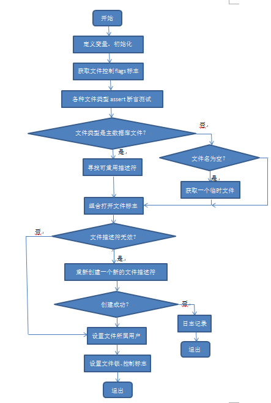

# 功能的主要实现
&nbsp;&nbsp;&nbsp;&nbsp;&nbsp;&nbsp;&nbsp;该文件对于功能的实现主要是通过一系列的函数和结构体。该文件的主线函数是sqlite3\_os\_init()，初始化操作系统接口，这个程序为所有类Unix操作系统的VFS实现注册。这个程序和紧随其后的sqlite3\_os\_end()程序是本文件中对其他文件可见的唯一程序，这个程序在SQLite初始化时便会通过单线程调用。 
&nbsp;&nbsp;&nbsp;&nbsp;&nbsp;&nbsp;&nbsp;这个文件挂载了一些VFS（虚拟文件系统），每个VFS都包含一套系统调用的接口： 
\#define UNIXVFS(VFSNAME, FINDER) { 
&nbsp;&nbsp;&nbsp;&nbsp;&nbsp;&nbsp;&nbsp;    3,                    /\* iVersion \*/ 
&nbsp;&nbsp;&nbsp;&nbsp;&nbsp;&nbsp;&nbsp;    sizeof(unixFile),     /\* szOsFile \*/ 
&nbsp;&nbsp;&nbsp;&nbsp;&nbsp;&nbsp;&nbsp;    MAX_PATHNAME,         /\* mxPathname \*/ 
&nbsp;&nbsp;&nbsp;&nbsp;&nbsp;&nbsp;&nbsp;    0,                    /\* pNext \*/ 
&nbsp;&nbsp;&nbsp;&nbsp;&nbsp;&nbsp;&nbsp;    VFSNAME,              /\* zName \*/ 
&nbsp;&nbsp;&nbsp;&nbsp;&nbsp;&nbsp;&nbsp;    (void\*)&FINDER,       /\* pAppData \*/ 
&nbsp;&nbsp;&nbsp;&nbsp;&nbsp;&nbsp;&nbsp;    unixOpen,             /\* xOpen \*/ 
&nbsp;&nbsp;&nbsp;&nbsp;&nbsp;&nbsp;&nbsp;    unixDelete,           /\* xDelete \*/ 
&nbsp;&nbsp;&nbsp;&nbsp;&nbsp;&nbsp;&nbsp;    unixAccess,           /\* xAccess \*/ 
&nbsp;&nbsp;&nbsp;&nbsp;&nbsp;&nbsp;&nbsp;    unixFullPathname,     /\* xFullPathname \*/ 
&nbsp;&nbsp;&nbsp;&nbsp;&nbsp;&nbsp;&nbsp;    unixDlOpen,           /\* xDlOpen \*/ 
&nbsp;&nbsp;&nbsp;&nbsp;&nbsp;&nbsp;&nbsp;    unixDlError,          /\* xDlError \*/ 
&nbsp;&nbsp;&nbsp;&nbsp;&nbsp;&nbsp;&nbsp;    unixDlSym,            /\* xDlSym \*/ 
&nbsp;&nbsp;&nbsp;&nbsp;&nbsp;&nbsp;&nbsp;    unixDlClose,          /\* xDlClose \*/ 
&nbsp;&nbsp;&nbsp;&nbsp;&nbsp;&nbsp;&nbsp;    unixRandomness,       /\* xRandomness \*/ 
&nbsp;&nbsp;&nbsp;&nbsp;&nbsp;&nbsp;&nbsp;    unixSleep,            /\* xSleep \*/ 
&nbsp;&nbsp;&nbsp;&nbsp;&nbsp;&nbsp;&nbsp;    unixCurrentTime,      /\* xCurrentTime \*/ 
&nbsp;&nbsp;&nbsp;&nbsp;&nbsp;&nbsp;&nbsp;    unixGetLastError,     /\* xGetLastError \*/ 
&nbsp;&nbsp;&nbsp;&nbsp;&nbsp;&nbsp;&nbsp;    unixCurrentTimeInt64, /\* xCurrentTimeInt64 \*/ 
&nbsp;&nbsp;&nbsp;&nbsp;&nbsp;&nbsp;&nbsp;    unixSetSystemCall,    /\* xSetSystemCall \*/ 
&nbsp;&nbsp;&nbsp;&nbsp;&nbsp;&nbsp;&nbsp;    unixGetSystemCall,    /\* xGetSystemCall \*/ 
&nbsp;&nbsp;&nbsp;&nbsp;&nbsp;&nbsp;&nbsp;    unixNextSystemCall,   /\* xNextSystemCall \*/ 
  } 
这是一套虚拟文件系统的标准系统调用接口，为一个sqlite3_vfs对象定义了一个初始化器，通过这些接口可以操作VFS下的文件。而挂载是在如下代码中完成的： 
  for(i=0; i<(sizeof(aVfs)/sizeof(sqlite3_vfs)); i++){ 
    &nbsp;&nbsp;&nbsp;&nbsp;&nbsp;&nbsp;&nbsp;sqlite3\_vfs\_register(&aVfs[i], i==0); 
 &nbsp;&nbsp;&nbsp;&nbsp;&nbsp;&nbsp;&nbsp; } 
  &nbsp;&nbsp;&nbsp;&nbsp;&nbsp;&nbsp;&nbsp;return SQLITE_OK;  
} 
所有为Unix的默认VFS都包含了如下数组： 
static sqlite3_vfs aVfs[] 
初始化的虚拟文件系统列表在这个数组中。 
而在如下代码中，定义了一套标准的系统调用接口组件： 
static struct unix_syscall { 
 &nbsp;&nbsp;&nbsp;&nbsp;&nbsp;&nbsp;&nbsp;const char \*zName;            /\* Name of the       system call \*/ 
 &nbsp;&nbsp;&nbsp;&nbsp;&nbsp;&nbsp;&nbsp;sqlite3\_syscall\_ptr pCurrent; /\* Current value of the system call \*/	 
  &nbsp;&nbsp;&nbsp;&nbsp;&nbsp;&nbsp;&nbsp;sqlite3\_syscall\_ptr pDefault; /\* Default value \*/  
} 
我们顺着主要的接口之一unixOpen()，得到其主线流程如下图所示： 

图1.1 unixOpen()程序流程图

