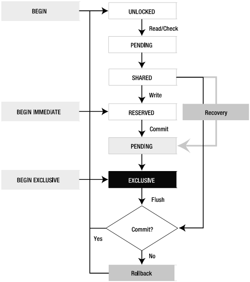

# SQLite锁机制简介
&nbsp;&nbsp;&nbsp;&nbsp;&nbsp;&nbsp;&nbsp;SQLite 采用粗放型的锁。当一个连接要写数据库，所有其它的连接被锁住，直到写连接结束了它的事务。SQLite 有一个加锁表，来帮助不同的写数据库都能够在最后一刻再加锁，以保证最大的并发性。 
&nbsp;&nbsp;&nbsp;&nbsp;&nbsp;&nbsp;&nbsp;SQLite 使用锁逐步上升机制，为了写数据库，连接需要逐级地获得排它锁。SQLite 有 5 个不同的锁状态：未加锁(UNLOCKED)、共享 (SHARED)、保留 (RESERVED)、未 决(PENDING)  和排它(EXCLUSIVE)。每个数据库连接在同一时刻只能处于其中一个状态。每种状态(未加锁状态除外)都有一种锁与之对应。锁的状态以及状态的转换如下图所示： 
&nbsp;&nbsp;&nbsp;&nbsp;&nbsp;&nbsp;&nbsp;最初的状态是未加锁状态，在此状态下，连接还没有存取数据库。当连接到了一个数据库，甚至已经用BEGIN 开始了一个事务时，连接都还处于未加锁状态。 
&nbsp;&nbsp;&nbsp;&nbsp;&nbsp;&nbsp;&nbsp;未加锁状态的下一个状态是共享状态。为了能够从数据库中读(不写)数据，连接必须首先进入共享状态，也就是说首先要获得一个共享锁。多个连接可以同时获得并保持共享锁，也就是说多个连接可以同时从同一个数据库中读数据。但哪怕只有一个共享锁还没有释放，也不允许任何连接写数据库。 
&nbsp;&nbsp;&nbsp;&nbsp;&nbsp;&nbsp;&nbsp;如果一个连接想要写数据库，它必须首先获得一个保留锁。一个数据库上同时只能有一个保留锁。保留锁可以与共享锁共存，保留锁是写数据库的第1 阶段。保留锁即不阻止其它拥有共享锁的连接继续读数据库，也不阻止其它连接获得新的共享锁。 一旦一个连接获得了保留锁，它就可以开始处理数据库修改操作了，尽管这些修改只能在缓冲区中进行，而不是实际地写到磁盘。对读出内容所做的修改保存在内存缓冲区中。 当连接想要提交修改(或事务)时，需要将保留锁提升为排它锁。为了得到排它锁，还必须首先将保留锁提升为未决锁。获得未决锁之后，其它连接就不能再获得新的共享锁了，但已经拥有共享锁的连接仍然可以继续正常读数据库。此时，拥有未决锁的连接等待其它拥有共享锁的连接完成工作并释放其共享锁。 一旦所有其它共享锁都被释放，拥有未决锁的连接就可以将其锁提升至排它锁，此时就可以自由地对数据库进行修改了。所有以前对缓冲区所做的修改都会被写到数据库文件。

图2.1 SQLite锁机机制的实现

&nbsp;&nbsp;&nbsp;&nbsp;&nbsp;&nbsp;&nbsp;另外，既然说到锁，我们认为应该对事务也作一个简单的介绍。SQLite有三种不同的事务，使用不同的锁状态。 事务可以开始于： DEFERRED、 MMEDIATE或 EXCLUSIVE。事务类型在BEGIN 命令中指定： BEGIN [ DEFERRED | IMMEDIATE | EXCLUSIVE ] TRANSACTION;  &nbsp;&nbsp;&nbsp;&nbsp;&nbsp;&nbsp;&nbsp;一个DEFERRED事务不获取任何锁(直到它需要锁的时候)，BEGIN 语句本身也不会做什么事情——它开始于 UNLOCK 状态。默认情况下就是这样的，如果仅仅用 BEGIN 开始一个事务，那么事务就是DEFERRED的，同时它不会获取任何锁；当对数据库进行第一次读操作时，它会获取SHARED锁；同样，当进行第一次写操作时，它会获取RESERVED锁。由 BEGIN 开始的 IMMEDIATE 事务会尝试获取 RESERVED 锁。如果成功，BEGIN IMMEDIATE保证没有别的连接可以写数据库。但是，别的连接可以对数据库进行读操作；但是，RESERVED锁会阻止其它连接的BEGIN IMMEDIATE或者BEGIN EXCLUSIVE命令，当其它连接执行上述命令时，会返回 SQLITE\_BUSY 错误。这时你就可以对数据库进行修改操作了，但是你还不能提交，当你COMMIT时，会返回SQLITE\_BUSY 错误，这意味着还有其它的读事务没有完成，得等它们执行完后才能提交事务。 
&nbsp;&nbsp;&nbsp;&nbsp;&nbsp;&nbsp;&nbsp;EXCLUSIVE事务会试着获取对数据库的EXCLUSIVE锁。这与 IMMEDIATE类似，但是一旦成功，EXCLUSIVE 事务保证没有其它的连接，所以就可对数据库进行读写操作了。 上节那个例子的问题在于两个连接最终都想写数据库，但是它们都没有放弃各自原来的锁，最终，SHARED 锁导致了问题的出现。如果两个连接都以BEGIN IMMEDIATE 开始事务，那么死锁就不会发生。在这种情况下，在同一时刻只能有一个连接进入BEGIN IMMEDIATE，其它的连接就得等待。BEGIN IMMEDIATE 和BEGIN EXCLUSIVE 通常被写事务使用。就像同步机制一样，它防止了死锁的产生。  
&nbsp;&nbsp;&nbsp;&nbsp;&nbsp;&nbsp;&nbsp;基本的准则是：如果你正在使用的数据库没有其它的连接，用BEGIN 就足够了。但是，如果你使用的数据库有其它的连接也会对数据库进行写操作，就得使用 BEGIN IMMEDIATE或 BEGIN EXCLUSIVE开始你的事务。
