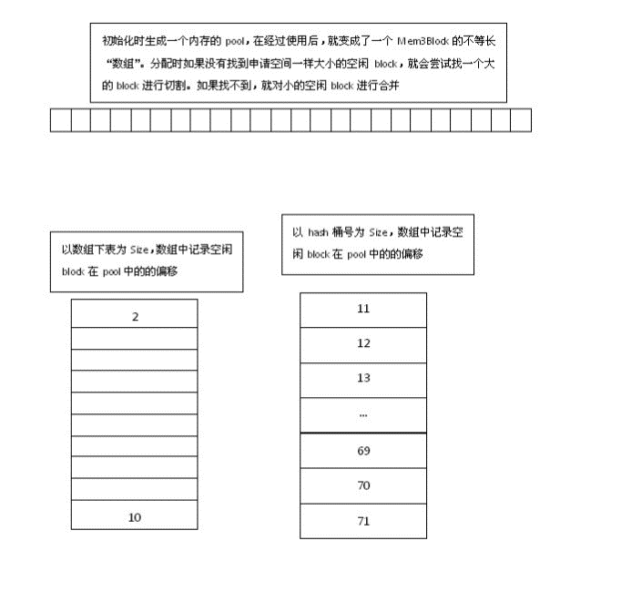
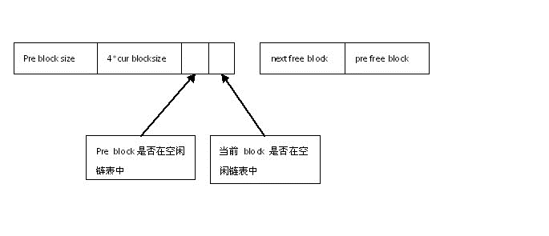

# mem3.c
&nbsp;&nbsp;&nbsp;&nbsp;&nbsp;&nbsp;&nbsp;如果SQLite使用SQLITE_MEMDEBUG编译时选项来编译，则使用一个不同的、对系统malloc(), realloc()和free()进行重型包装的内存分配器。重型包装器对每个分配请求多分配100字节的额外空间，用来在分配的末尾放置哨兵值。当一个分配被释放时，检查这些哨兵值以确保SQLite内核没有超出缓冲区的两端。当系统库来自GLIBC时，重型包装器也会使用GNU backtrace()函数来检查栈，并记录malloc()调用的祖先函数。当运行测试套件时，重型包装器还会记录当前测试用例的名称。这两个特性对跟踪内存泄漏是非常有用的。

&nbsp;&nbsp;&nbsp;&nbsp;&nbsp;&nbsp;&nbsp;Mem3内存在系统初始化时，就分配好了。

&nbsp;&nbsp;&nbsp;&nbsp;&nbsp;&nbsp;&nbsp;总内存空间是固定的。所以不会出现内存泄露的问题。

&nbsp;&nbsp;&nbsp;&nbsp;&nbsp;&nbsp;&nbsp;这个对于嵌入式的软件来说可能是比较合适的。

&nbsp;&nbsp;&nbsp;&nbsp;&nbsp;&nbsp;&nbsp;Memsys3使用内存缓冲区来满足所有的内存分配需要。它与memsys5的区别是使用不同的内存分配算法，这个算法在实践中看起来工作得很好，但不能为避免内存碎片和内存崩溃提供数学保证。Memsys3是memsys5的前任，SQLite开发者相信memsys5比memsys3更好，所有需要零分配内存分配器的应用程序应该使用memsys5而不是memsys3。

Mem3:

#####1、按照分配内存的大小分两组来管理
&nbsp;&nbsp;&nbsp;&nbsp;&nbsp;&nbsp;&nbsp;比如申请空间为8个block（每个block 8byte）大小的内存空间。那么就会去左边8block的空闲链表里面去找，如果没找到就去看系统最大的一块free Mem3Block（在内存的最后面，系统刚开始时只有这个，相当于内存分配的源头）是否有空间。

&nbsp;&nbsp;&nbsp;&nbsp;&nbsp;&nbsp;&nbsp;如果没有就进行合并。申请一个100block大小的内存空间。 100%61 = 39.在右边桶值为39的hash链中找一个100block大小的空闲块。

#####2、空闲双向链表的实现
&nbsp;&nbsp;&nbsp;&nbsp;&nbsp;&nbsp;&nbsp;如果前面一个block被checkout，Pre block size的4byte可以被其使用。
如果当前block 被checkout，用于空闲链的next free block和pre free block可以被使用。

