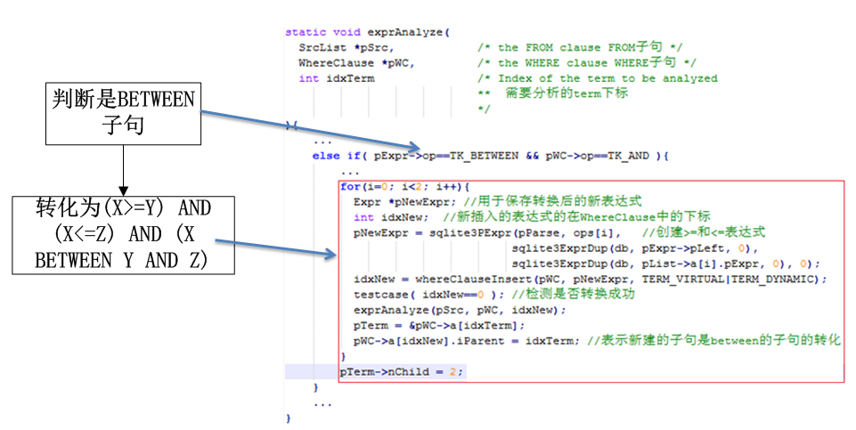

# BETWEEN语句优化
&nbsp;&nbsp;&nbsp;&nbsp;&nbsp;&nbsp;&nbsp;如果被分割的子句包含BETWEEN语句，则把BETWEEN语句转化成两个不等式约束。 
&nbsp;&nbsp;&nbsp;&nbsp;&nbsp;&nbsp;&nbsp;例如： 
<pre>
        expr1 BETWEEN expr2 AND expr3
</pre>
&nbsp;&nbsp;&nbsp;&nbsp;&nbsp;&nbsp;&nbsp;可以转化为： 
<pre>
        expr1 >= expr2 AND expr1 <= expr3
</pre>
&nbsp;&nbsp;&nbsp;&nbsp;&nbsp;&nbsp;&nbsp;转化后的语句只是用来分析，而不会产生VDBE代码。如果BETWEEN语句已经被编码，那么转化后的语句将会被忽略，而如果BETWEEN语句还未被编码且转化后的语句可以使用索引，那么系统将会跳过BETWEEN子句。

执行步骤和程序实现如下：

