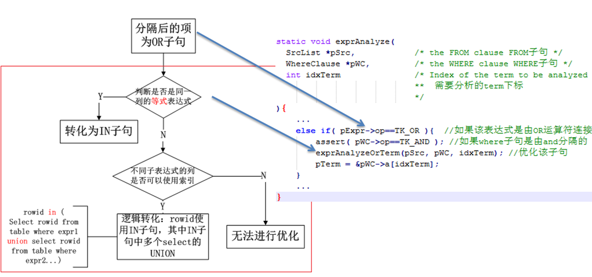

# OR语句优化
当分割的子句是OR子句连接时，有两种情况：
 
1.如果OR子句连接的各个子句都是在同一表上的同一列的等式约束，则可以使用IN语句来替换OR子句；
 
2.如果OR子句连接的各个子句不是在同一列上的约束并且如果各个子句的操作符是"=", "<", "<=", ">", ">=", "IS NULL", or "IN"中的一个，并且各个子句中的列是某些索引的初始列，那么就可以把这个OR子句概念上重写为UNION子句，并且每个列都可以使用相应的索引进行查询优化。
  
注：如果一个OR子句上述的两种情况都满足，则会默认使用第一种方式进行优化。

执行步骤和程序实现如下：

