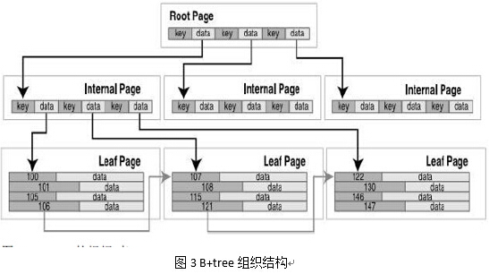

# SQLite中的B-tree
&nbsp;&nbsp;&nbsp;&nbsp;&nbsp;&nbsp;&nbsp;SQLite中每个数据库完全存储在单个磁盘文件中，因为B树进行数据的查找、删除、添加速度快，所以这些数据以B树数据结构的形式存储在磁盘上（实现代码在btree.c源文件中）。INGRES那样的DBMS，也用树结构（如B树）来实现存储，以支持借助于多级目录结构的按关键字存取。B树的典型结构如图2所示。B+树是应文件系统所需而出的一种B-树的变型树。B+树可以进行两种查找算法，第一种，从最小关键字起顺序查找；第二种，从根结点开始，进行随机查找。B-tree应用到数据库的每个表和索引中。所有B-tree存储在相同的磁盘文件中。

&nbsp;&nbsp;&nbsp;&nbsp;&nbsp;&nbsp;&nbsp;B-tree为SQLiteVDBE提供O（㏒N）级时间复杂度的查询和插入，通过遍历记录实现O（1）级时间复杂度的删除。B-tree是自平衡的，并能够对碎片清理和内存再分配进行自动管理。B-tree对如何读写磁盘没有限定，只是关注页之间的关系。
&nbsp;&nbsp;&nbsp;&nbsp;&nbsp;&nbsp;&nbsp;B-tree的职责就是排序，它维护着多个页之间错综复杂的关系，这些关系能够保证快速定位并找到一切有联系的数据。B-tree将页面组织成树状结构，这些组织结构很适合搜索，页面就是树的叶子。Pager帮助B-tree管理页面，它负责传输。B-tree是为查询而高度优化了的。它使用特殊的算法来预测将来要使用哪些页，从而让B-tree保存该页面以便尽可能快地工作。
&nbsp;&nbsp;&nbsp;&nbsp;&nbsp;&nbsp;&nbsp;数据库中所有的页都是以1开始顺序编号的。一个数据库是由多个B-tree组成的——每张表以及每个索引各对应一个B-tree。数据库中每张表或索引都以根页面作为第一页。所有的索引和表的根页面都存储在sqlite_master表中。
&nbsp;&nbsp;&nbsp;&nbsp;&nbsp;&nbsp;&nbsp;B-tree中的页由一系列B-tree记录组成，这些记录也称为有效载荷。这些记录不是传统的数据库记录（表中有多个列的那种格式），而是更为原始的格式。一个B-tree记录（有效载荷）仅由两个域组成：键值域和数据域。键值域是每个数据库表中所包含的ROWID值或主键值；在B-tree中，数据域可以包含任意类型的内容。最终，数据库的记录信息存储在数据域中。B-tree用来保持记录有序并方便记录的查询，同时，键值域能够完成B-tree的主要工作。此外，记录（有效载荷）的大小是可变的，这取决于内部键值域和数据域的大小。一般而言，每个页拥有多个有效载荷，但如果一个页的有效载荷超出了一个页的大小，将会出现跨越多个页的情况（包括blob类型的记录）。
&nbsp;&nbsp;&nbsp;&nbsp;&nbsp;&nbsp;&nbsp;B-tree记录按键值顺序存储。所有的键值在一个B-tree中必须唯一（由于键值对应于rowid主键，主键具有唯一性）。表使用B+tree定义在内部页中，不包含表数据（数据库记录）。图3为B+tree表示一个表的实例。

&nbsp;&nbsp;&nbsp;&nbsp;&nbsp;&nbsp;&nbsp;B+tree的根页面和内部结点页都用于搜索导航。这些页中的数据域均指向下一层页，这些页只包含键值。所有的数据库记录都存储在叶子页中，在叶子页层，记录和页按键值顺序排列，以便B-tree游标能够遍历记录（水平遍历）。
