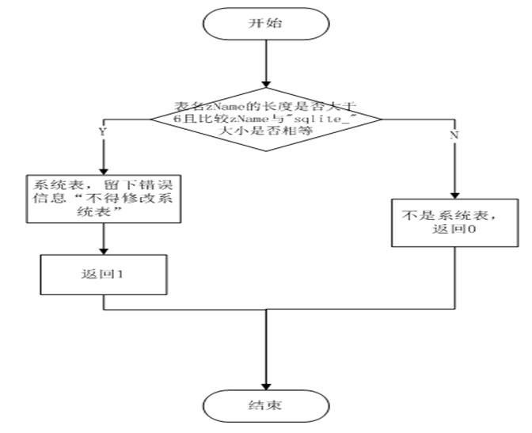

# 判断一个系统表
7.1函数头

static int isSystemTable(Parse *pParse, const char *zName)

7.2 工作流程

（1）如果表是一个系统表,这个函数在pParse- > zErr里留下一个错误消息(不得改变系统表)并返回非零。

（2）如果zName不是系统表,则返回0。其中参数zName是一个即将改变的表的名称

如图为isSystemTable函数实现流程

