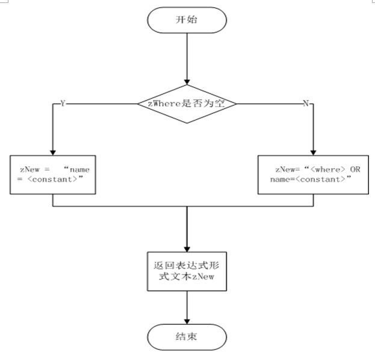

# 创建表达式形式的文本
4.1  函数头

static char *whereOrName(sqlite3 *db, char *zWhere, char *zConstant)

&nbsp;&nbsp;&nbsp;&nbsp;&nbsp;&nbsp;&nbsp;这个函数是用于创建表达式形式的文本:名称= < constant1 >或名称= < constant2 >或…

4.2 工作流程

（1）如果参数zWhere是NULL,那么指针包含文本字符串返回“name = <常数> ",
这个地方的<常数>是引用版本的字符串作为参数传递的zConstant。

（2）返回的缓冲区分配使用sqlite3DbMalloc()。

（3）如果参数zWhere不为空,则返回的字符串是"<where> OR name=<常数>",
注：这里的<where> 是zWhere的内容。

（4）在这种情况下，返回之前，zWhere传递给sqlite3DbFree()

（5）返回新的表达式文本zNew

如图为whereOrName函数实现流程

