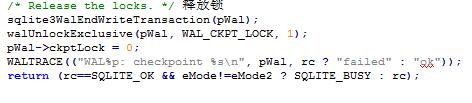

# 检查点
&nbsp;&nbsp;&nbsp;&nbsp;&nbsp;&nbsp;&nbsp;&nbsp;我们最终会将追加在Wal文件中的说有事务写回到初始的数据库中，将Wal文件中事务写回到数据库中被叫做“检查点”。 
&nbsp;&nbsp;&nbsp;&nbsp;&nbsp;&nbsp;&nbsp;&nbsp;回滚和预写另一个不同是回滚日志有两个原语操作：读和写，而Wal有三个原语操作：读，写，检查点。默认的，Sqlite 当达到1000页这个阀值是就会自动的设置一个检查点。 
&nbsp;&nbsp;&nbsp;&nbsp;&nbsp;&nbsp;&nbsp;&nbsp;Sqllite Wal自动设置检查点编译时间 可以指定不同的默认值。使用Wal的程序不必为了使这些检查点产生而做任何事。但他们如果想设置检查点，可以调整自动设置检查点的阀值，他们可以关闭自动设置检查点在空闲时或在只有一个线程或进程时。 
&nbsp;&nbsp;&nbsp;&nbsp;&nbsp;&nbsp;&nbsp;&nbsp;sqlite3WalCheckpoint(）用来实现sqlite3_wal_checkpoint()和相关接口。获取一个checkpoint锁，然后尽可能多的回填信息到数据中。 
 
&nbsp;&nbsp;&nbsp;&nbsp;&nbsp;&nbsp;&nbsp;&nbsp;当用SQLITE_BUSY意味着另一个线程或进程已经在运行checkpoint或则进行恢复。如果无法获得写锁,那么一个被动的检查点将代替运行。由于checkpoint无法加载锁，是毫无意义的阻塞等待任何读者，假设没有其他错误发生时,该函数将返回SQLITE_BUSY给调用者。 
 
&nbsp;&nbsp;&nbsp;&nbsp;&nbsp;&nbsp;&nbsp;&nbsp;读取 Wal-index 头和将日志文件中的数据拷贝到数据文件中. 

&nbsp;&nbsp;&nbsp;&nbsp;&nbsp;&nbsp;&nbsp;&nbsp;释放锁和调用结束事务.

