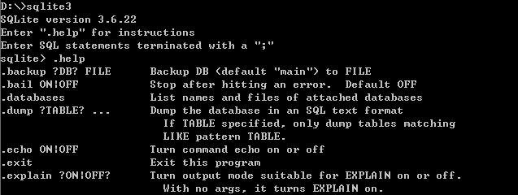
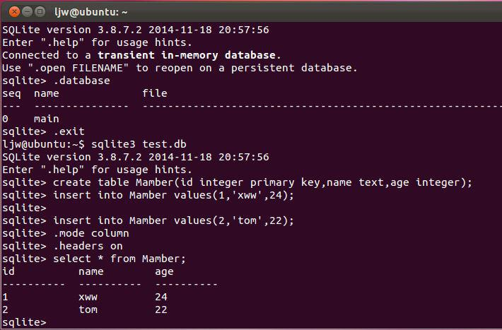

# Shell模式下使用CLP
&nbsp;&nbsp;&nbsp;&nbsp;&nbsp;&nbsp;shell.c文件包括main()函数，用于创建CLP（静态链接的命令行程序）可执行程序。编译成功后，在命令行输入sqlite3 [数据库文件名]，可触发CLP的shell模式，并连接到一个临时的内存中的数据库。CLP以交互形式运行，可以执行查询、获得schema信息、导入/导出数据以及其他数据库任务。
如果创建一个称为test.db的数据库，在DOS shell下键入：sqlite3 test.db，一旦数据库创建之后就不能再修改。 
1）执行数据查询

    sqlite> .mode col
    sqlite> .headers on
    sqlite> SELECT * FROM test;
&nbsp;&nbsp;&nbsp;&nbsp;&nbsp;&nbsp;两个命令(.headers and .mode)用于改进输出的格式，后面做详细说明。
CLP会将输入的任何语句当成查询命令，除非它是以“.”开头的，这些以点号开始的命令是为指定的CLP操作预留的，通过键入.help命令获取完整的操作列表（以下是部分操作码）：

2）获得数据库的Schema信息 
&nbsp;&nbsp;&nbsp;&nbsp;&nbsp;&nbsp;你可以键入命令.tables [pattern]来得到所有表和视图的列表，其中[pattern]可以是任何类SQL的操作符。执行上述命令会返回符合条件的所有表和视图，如果没有pattern项，返回所有表和视图。

    sqlite> .tables
    schema test
可以看到我们创建的表test和视图schema。

3）数据导出 
&nbsp;&nbsp;&nbsp;&nbsp;&nbsp;&nbsp;可以使用.dump命令将数据库导出为SQL格式的文件。不使用任何参数，.dump将导出整个数据库。如果提供了参数，Shell将参数解析作为表名或视图，导出任何匹配给定参数的表或视图，那些不匹配的将被忽略。使用.dump[filename]命令，此命令将所有的输出重定向到指定的文件中。若要恢复到屏幕的输出，只需要执行.output stdout命令就可以了。

    sqlite> .output file.sql
    sqlite> .dump
    sqlite> .output stdout
&nbsp;&nbsp;&nbsp;&nbsp;&nbsp;&nbsp;有两种方法可以导入数据，用哪种方法决定于要导入的文件的格式。如果文件由SQL语句构成，可以使用.read命令导入(执行)文件中包含的命令。如果文件是由逗号或其它定界符分隔的值(comma-separated values, CSV)组成，可使用.import [file][table]命令。此命令将解析指定的文件并尝试将数据插入到指定的表中。

    sqlite> .show
    echo: off
    explain: off
    headers: on
    mode: column
    nullvalue: ""
    output: stdout
    separator: "|"
    width:
&nbsp;&nbsp;&nbsp;&nbsp;&nbsp;&nbsp;.read命令用来导入由.dump命令创建的文件。如果要使用前面作为备份文件所导出的file.sql，需要先移除已经存在的数据库对象(test表和schema视图)，然后用下面方法导入：

    sqlite> drop table test;
    sqlite> drop view schema;
    sqlite> .read file.sql
4）格式化 
&nbsp;&nbsp;&nbsp;&nbsp;&nbsp;&nbsp;CLP提供了几个格式化选项命令。
.echo是最简单的, 如果设置.echo on，则新输入的命令在执行前都会回显，默认值是off。

&nbsp;&nbsp;&nbsp;&nbsp;&nbsp;&nbsp;.headers设置为on时，查询结果显示时带有字段名。

. nullvalue，当遇到NULL值时，如果需要以一个字符串来显示，使用.nullvalue命令设置，如：

    sqlite> .nullvalue NULL 默认情况下使用空串。

&nbsp;&nbsp;&nbsp;&nbsp;&nbsp;&nbsp;.prompt：如果要改变CLP的shell提示符，使用.prompt [value]，如：

    sqlite> .prompt 'sqlite3> '
    sqlite3>
&nbsp;&nbsp;&nbsp;&nbsp;&nbsp;&nbsp;第一行的提示符默认为: "sqlite> "
以后行的默认提示符为: "   ...> "
&nbsp;&nbsp;&nbsp;&nbsp;&nbsp;&nbsp;.mode命令可以设置结果数据的几种输出格式。可选的格式为csv、column、html、insert、line、list、tabs和tcl。默认值是list，在此模式下显示结果时列间以默认的分隔符分隔。
而在Shell模式下处理SQL语句对返回结果的展示。CLP提供了以下8中输出显示方式，每种显示方式会呈现不同的显示，满足不同用户的显示需求。

&nbsp;&nbsp;&nbsp;&nbsp;&nbsp;&nbsp;Shell.c中的相关宏定义：

    static const char *modeDescr[] = { /*定义允许的模式字符数组；数据显示格式；有好几种显示模式，默认的是 list 显示模式，一般我们使用 column 显示模式*/
      "line",    //每行一个值
      "column",   //以整齐的列显示每一行数据
      "list",    //分隔符分隔的字符
      "semi",    //和list模式类似，但是每一行会以“；”结束
      "html",     //以html代码方式显示
      "insert",  //显示insert sql语句
      "tcl",    //TCL列表元素
      "csv",     //逗号分隔值
      "explain",  //和column类似，但不截断数据
    };
&nbsp;&nbsp;&nbsp;&nbsp;&nbsp;&nbsp;默认的是list显示模式，一般我们使用column显示模式，如：

&nbsp;&nbsp;&nbsp;&nbsp;&nbsp;&nbsp;每种输出显示模式下，都会涉及不同的处理方式，一下列出不同输出模式下调用的输出方法。

    output_hex_blob(FILE *out, const void *pBlob, int nBlob) //将字符串以hex二进制编码的方式输出
    output_quoted_string(FILE *out, const char *z)//将字符串以引证字符串的形式输出
    output_c_string(FILE *out, const char *z) //根据C或TCL引用规则输出字符串
    output_html_string(FILE *out, const char *z) //以特殊的HTML代码方式显示字符串
    output_csv(struct callback_data *p, const char *z, int bSep)//以csv格式输出字符串
    （其中p->separator被用作表示分隔符，p->nullvalue表示NUll值，字符串只有在必要的时候被引用）
5）中断退出操作 
&nbsp;&nbsp;&nbsp;&nbsp;&nbsp;&nbsp;.exit 或 ctrl+D（linux）或ctrl+C（win）退出CLP模式

在shell.c中：

&nbsp;&nbsp;&nbsp;&nbsp;&nbsp;&nbsp;如果你想以CSV格式输出一个表的数据，可如下操作：

    sqlite3> .output file.csv
    sqlite3> .separator ,
    sqlite3> select * from test;
    sqlite3> .output stdout

&nbsp;&nbsp;&nbsp;&nbsp;&nbsp;&nbsp;因为有一个CSV模式，所以下面的命令会得到相似的结果：

    sqlite3> .output file.csv
    sqlite3> .mode csv
    sqlite3> select * from test;
    sqlite3> .output stdout

6）另外还有一些简单命令 
 .indices 
&nbsp;&nbsp;&nbsp;&nbsp;&nbsp;&nbsp;功能：显示索引的名字。没有指定参数则显示所有索引，有参数则显示指定表的索引。 
.restore 
&nbsp;&nbsp;&nbsp;&nbsp;&nbsp;&nbsp;功能：从指定的文件还原数据库，缺省为main数据库。此时也可以指定其他数据库名，被指定的数据库成为当前连接的attached数据库。 
.backup 
&nbsp;&nbsp;&nbsp;&nbsp;&nbsp;&nbsp;功能：备份一个指定的数据库（A）到指定的文件（B，缺省为当前连接的main数据库）。
