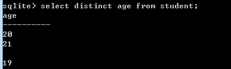
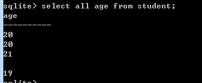

# 3.6.1    all和distinct子句
 （1）distinct具体执行：distinct返回的结果是没有相同属性的行。
 如： ID   Name  Age
 1    a     20
 2    b     20
 3    c     21
 4    d     null
 5    e     19
 使用两个20，只会输出一个。NULL值（这个一般不确定，这里验证一下）会被输出一个空。如下图：

 （2）如果使用all 会全部输出，如下图：

