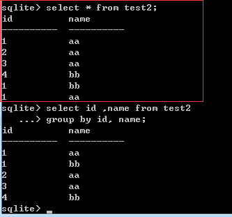

# GROUP子句具体使用
  分组函数，通常用在聚集函数中。group by 属性名 ，如：select sex,AVG（age）from student group by sex
先执行group by再执行select。表达的意思为：按性别分组，求出每组的平均年龄。根据上文中test表，进行测试group by子句，如下图：

  表达的意思是，按value属性分组，每组最大的id是多少。这里总结为格式“按**属性分组，每组的属性的最大/最小/平均值/count(属性)为多少”。
而group by后可以跟多个属性， SQLite中定义为表达式列表，可以存储多个group by子句（ExprList *pGroupBy）
group by后跟多个属性例子如下图

  递归遍历表达式列表，先对id进行分组，分为1，2，3，4。再根据name进行分组。
不得不提这种情况 ,如：select id from test2 group by name

  小结：SQLite中，group by 也会先执行排序操作，与order by相比，group by只是多了排序之后的分组。
深入一步：

  这是表中数据

