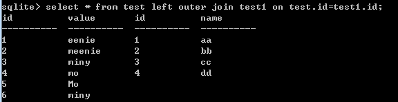
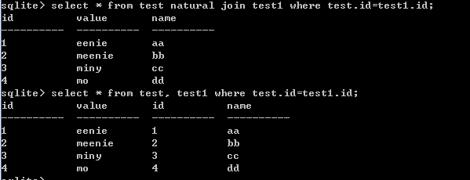

# ON子句具体使用
1.inner join（内连接）：
表test

表test1
 

进行内连接(执行语句)：sqlite> select * from test inner join test1 on test.id=test1.id;
执行结果：
 

执行原理：先循环表test中的id，再循环表test1。根据关键词ON，只用ON表达式认为每一行的笛卡尔积是一个布尔表达式。只有表达式为true的行才会放到数据集中。
上文提到on与where不同，这里进行where(执行语句)：sqlite> select * from test,test1 where test.id=test1.id;
执行结果：
 

运行的结果一样，但是on与where的效率不同。具体在left outer join中分析。
2.left outer join（左外连接）：
使用on子句，先进行on的过滤, 而后才进行join。使用where子句，得出全部的笛卡尔积，再过滤。在left outer join中on与where区别最为明显。
使用left outer join on会返回左表中未选中的行，如下图：

使用where子句，只返回where判断为true的行，如下图：

使用on与where区别：
1.执行子句的顺序优先级别为：ON,  JOIN,  WHERE. 使用on子句，先进行判断，返回为true的行（生成中间结果集），再执行left outer join,检测到left outer join,会将on中为左表中的行均取出，不管是否为true。而使用where子句，先执行left outer join, 会把两个表连接一起，再从中间结果集中进行判断，这样只返回了判断为true的结果行。
2.使用on子句就避免了两个大表产生全部数据的笛卡尔积的庞大数据。而且更符合SQL92标准（这个是从博客上看到的）。
补充：如果不因为执行顺序影响结果集的话，ON WHERE Having产生的结果集会相同。在下文中的WHERE子句和Having子句中会介绍。
Inner join 多表连接（执行语句）：
SELECT SNAME, STUDENT.DNAME, CNAME, CTEST, MARK, TNAME
FROM TEACHER  INNER JOIN  COURSE ON TEACHER.CNO = COURSE.CNO
INNER JOIN  STUDENT ON TEACHER.CNO = STUDENT.CNO
ORDER BY SNAME
CROSS JOIN(交叉连接)
交叉连接（CROSS JOIN）把第一个表的每一行与第二个表的每一行进行匹配。如果两个输入表分别有 x 和 y 列，则结果表有 x+y 列。由于交叉连接（CROSS JOIN）有可能产生非常大的表，使用时必须谨慎，只在适当的时候使用它们。

natural join与等值连接（默认使用inner join连接）
其中natural join会将右表中相同属性名的列不输出。而等值连接会输出相同属性  名下的列。

