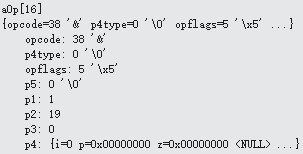

# OP_MustBeInt
下图是OP_MustBeInt的内容:

 
 ```
case OP_MustBeInt : {
	pIn1 = &aMem[pOp->p1];
	if( (pIn1->flags & MEM_Int)==0 ){……}//条件为假，不执行
}```
OP_MustBeInt操作符用于确认p1的值是否为整形，不是然后还不能转换为整形的话就跳转到p2指向的操作符去，但是这里p1为整形，所以不执行这么操作。pc加1为17，下一个要执行的是aOp[17] OP_NotExists。
