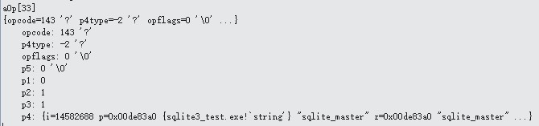

# OP_TableLock
下图是OP_TableLock的内容:


```
case OP_TableLock: {
u8 isWriteLock = (u8)pOp->p3;
sqlite3BtreeLockTable(db->aDb[p1].pBt,pOp->p2,isWriteLock){
if( p->sharable ){   //db->aDb[p1].pBt->sharable为0
		sqlite3BtreeEnter(p);
	    	……
	     }
	}
}

```
OP_TableLock操作符功能就是在共享缓存的前提下给我们要创建的表加写锁，但是由于我们没有使用共享缓存，所以这里没有对表加写锁。pc加1，为34，下一个要执行的是aOp[34] OP_Goto。
