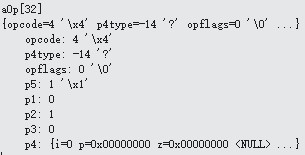

# OP_Transaction
下图是OP_Transaction的内容:


```
case OP_Transaction: {
Btree* pBt = db->aDb[pOp->p1].pBt;         	        	sqlite3BtreeBeginTrans(pBt, pOp->p2){
	  sqlite3BtreeEnter(p);
	  sqlite3PagerBegin();
	  newDatabase(pBt);
	  sqlite3PagerOpenSavepoint(pBt->pPager, p->db->nSavepoint);
	 }
}

```
OP_Transaction操作符的作用就是开始执行一个事务，sqlite3BtreeBeginTrans根据p2的值确定是读或写，这里p2的值为1，所以为写事务，进入sqlite3BtreeBeginTrans函数后，先是通过sqlite3BtreeEnter函数在后端级别上（Btree和Pager）给当前操作加锁，然后通过sqlite3PagerBegin函数对内存进行操作，实现对内存中的数据库的操作。newDatabase函数就是在数据库为空没有内容的时候初始化数据库中的第一个page，然后执行sqlite3PagerOpenSavepoint函数在这个page中保存操作点。pc加1，为33，下一个要执行的是aOp[33] OP_TableLock。
