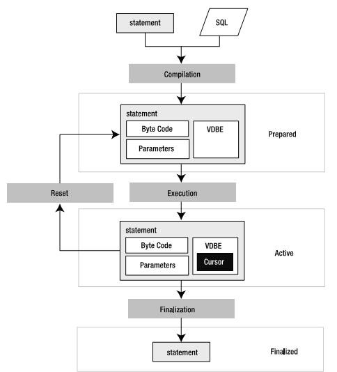

# 3.	SQLite执行过程
使用SQLite的C API函数可以对SQLite执行的过程有一个清晰的了解，就像SQLite结构图（图1-1）中一样，SQLite执行有三个大的步骤，具体过程如图3-1所示：

SQLite首先创建或者打开一个数据库，然后执行相应的SQL语句，最后关闭数据库，这也是数据库操作的一般步骤。在执行SQL命令过程中，又分为了三个阶段，在Prepare阶段，输入的SQL语句通过分析器（parser），分词器(tokenizer)和代码生成器(code generator)编译成VDBE字节码。传入sqlite3VdbeExec函数的Vdbe类型指针变量p中，已经包含了所有需要执行的操作码(如图3-2)。p中的aOp的官方解释为：Space to hold the virtual machine‘s program，根据图3-3可以看出，aOp是存放操作符的空间。

在执行阶段，虚拟机执行操作符，执行过程是一个步进的过程，每一步都是由sqlite3_step函数启动，并由sqlite3VdbeExec函数执行由Prepare阶段编译的操作符。在Final阶段，先是执行sqlite3VdbeFinalize函数关闭VDBE，然后执行sqlite_finalize()函数结束SQLite的执行。通过下图3-4可以更容易理  解这个过程。

