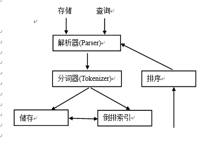
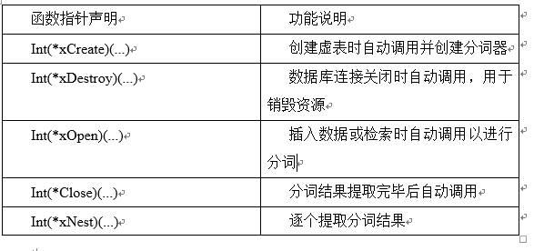

# 全文检索(full-text search)

## 4.1简介


 全文检索技术实际上在很多地方早有应用，例如在管理图书馆图书的时候，会使用书签来标识图书的内容，而这个标志来自对图书内容的概括和分类，有时候也直接取图书中的关键字段来标识图书。然后这仅仅只是全文枷锁的简单应用，如今海量网络数据，要想在这海量数据中搜索想要的知识，仅仅只靠提取网页中的几个关键字来标识数据往往得不到准确地数据，因此而应运而生了像Google这样的专业搜索公司。下面就是全文检索的过程。
 
 首先来说说倒排索引和倒排表为什么我们要说倒排索引呢? 
 
 因为倒排索引是目前 搜索引擎公司最对搜索引擎最常用的存储方式.也是搜索引擎的核心内容!在搜索引擎实际的应用之中,有时需要按照关键字的某些值查找记录,所以我们是按照关键字建立索引,这个索引我们就称之为: 倒排索引, 而带有倒排索引的文件我们又称作: 倒排索引文件，也可以叫它为: 倒排文件。用它来实现快速的检索与高速的效率!
 
  倒排文件中的次关键字索引，我们称做: 倒排表。其主要优点是:
  
 在处理复杂的多关键字查询时，可在倒排表中先完成查询的交、并等逻辑运算，得到结果后再对记录进行存取。这样不必对每个记录随机存取，把对记录的查询转换为地址集合的运算，从而提高查找速度!
 


## 4.2工作原理

实现全文检索工作原理如下图：


当存储一条文档数据时，解析器与分词器将该文档数据划分成各自独立的词项，并为每个词项建立一个倒排索引。当查询时，解析器与分词器将查询数据进行词项划分，然后遍历倒排索引，找到其相应的记录号，最后根据与查询条件的相关性等排序规则，返回结果集。

  FTS虚表的使用方法同普通表类似，可以进行插入、删除、修改等操作。创建具有title、contents两个TEXT类型的字段，使用Porter内置分词器虚表sms的SQL语句如下：
  
```
CREATE VIRTUAL TABLE sms USING fts1(title,contents.tokenize=porter);
使用MATCH关键字对contents字段及其sms虚表的所有字段进行全文检索的SQL语句分别如下：
SELECT title,contents FROM sms WHERE contents MATCH’Let the bullets fly’
SELECT title,contents FROM sms WHERE sms MATCH’Let the bullets fly’

```


Sqlite3_tokenizer_module结构体定义了自定义分词器实现全文检索所要实现的接口

Sqlite3_tokenizer_module结构体函数指针



 一般来说，全文检索需要具备建立索引和提供查询者两项基本功能。功能上，全文检索核心具有建立索引、增加索引、优化索引、处理查询返回结果集等功能。全文检索中索引的组织记录方法有两种，即正排表和倒排表。正排表示以文档的ID为关键词，表中记录项记录文档中每个词的位置信息，查找时扫描表中每个文档中词的信息直到找出所有包含查询关键词的文档。
 
  索引扫描：指非结构化数据经过索引之后形成的结构化数据中，按照顺序扫描的方法进行字符串匹配的过程。
  
  上面的说法比较抽象，举个例子来说，上小学的时候，语文老师叫我们查一个字的读音。在查字典的时候首先会先根据这个字偏旁部首的笔画，找到片片能够不受所在的位置，然后在根据剩下的笔画中查找这个字，找到这个之后就能找到这个字在词典页的位置，然后翻到该页，就能知道这个字的读音了，在字典的最开始收录了整个字典所包含的字，并根据偏旁部首再进行划分，整个查找过程我们仅仅只需要在字典首页的那几页进行查找，而且还有由偏旁部首到具体字的二级映射。
  
  全文检索，就是先建立索引，然后在索引中进行搜索的过程。
  创建索引和搜索索引是全文检索的两个必要环节，其中将非结构化数据经过一定的抽取和拼装算法，最后形成结构化数据的过程被称为索引。而搜索索引就是将用户的匹配字符串，在我们事先创建的结构化索引文件中，按顺序扫描，然后将搜索到的结果按照一定的排序算法，返回给用户的过程。由此需要先解决全文检索本身存在的三个关键问题，
  
①首先是索引里面究竟存的是什么，

②其次如何来生成这个索引，

③最后要如何对索引进行搜索


