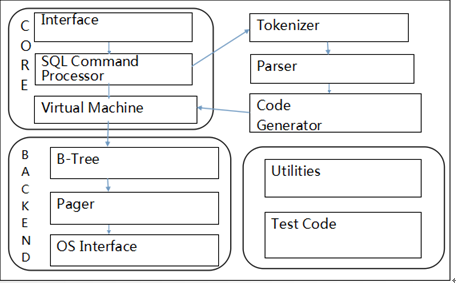

# SQLite简介

SQLite 由以下几个组件组成：SQL 编译器、内核、后端以及附件组成。
接口：接口由SQLite C API组成，也就是说不管是程序、脚本语言还是库文件，最终都是通过它与SQLite交互的.

在编译器中，分词器（Tokenizer）和分析器(Parser)对SQL进行语法检查，然后把它转化为底层能更方便处理的分层的数据结构---语法树，然后把语法树传给代码生成器(code generator)进行处理。而代码生成器根据它生成一种针对SQLite的汇编代码，最后由虚拟机(Virtual Machine)执行。

