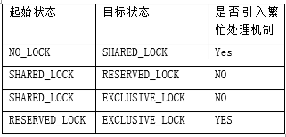

# 锁机制
2.9.1 锁模式 
&nbsp;&nbsp;&nbsp;&nbsp;&nbsp;&nbsp;&nbsp;sqlite3PagerLockingMode()得到/设定这个页面的锁模式。参数eMode一定是PAGER_LOCKINGMODE_QUERY，PAGER_LOCKINGMODE_NORMAL或者PAGER_LOCKINGMODE_EXCLUSIVE中的一个。如果参数是not _QUERY，那么锁模式被赋值为指定的值。 
&nbsp;&nbsp;&nbsp;&nbsp;&nbsp;&nbsp;&nbsp;返回值是PAGER_LOCKINGMODE_NORMAL或者PAGER_LOCKINGMODE_EXCLUSIVE中的一个，表明当前（可能会更新）的锁模式。 

2.9.2锁类型 
①NO_LOCK 
②SHARED_LOCK 
③RESERVED_LOCK 
④EXCLUSIVE_LOCK 
⑤UNKNOWN_LOCK 
&nbsp;&nbsp;&nbsp;&nbsp;&nbsp;&nbsp;&nbsp;当页面锁状态发生改变时，是否需要引入繁忙处理机制，如下图所示。 

起始状态	目标状态	是否引入繁忙处理机制
NO_LOCK	SHARED_LOCK	Yes 
SHARED_LOCK	RESERVED_LOCK	NO 
SHARED_LOCK	EXCLUSIVE_LOCK	NO 
RESERVED_LOCK	EXCLUSIVE_LOCK	YES 

数据库稳定性的三个等级： 
①OFF：系统对于临时文件的默认状态。 
②NORMAL：日志文件在写操作开始之前被同步过一次。 
③FULL：日志文件在写操作开始之前被同步过二次。 

2.9.3 读锁 
&nbsp;&nbsp;&nbsp;&nbsp;&nbsp;&nbsp;&nbsp;在SQLite写数据库之前，它必须先从数据库中读取相关信息。比如，在插入新的数据时，SQLite会先从sqlite_master表中读取数据库模式(相当于数据字典)，以便编译器对INSERT语句进行分析，确定数据插入的位置。 
&nbsp;&nbsp;&nbsp;&nbsp;&nbsp;&nbsp;&nbsp;在进行读操作之前，必须先获取数据库的共享锁(shared lock)，共享锁允许两个或更多的连接在同一时刻读取数据库。但是共享锁不允许其它连接对数据库进行写操作。shared lock存在于操作系统磁盘缓存，而不是磁盘本身。文件锁的本质只是操作系统的内核数据结构，当操作系统崩溃或掉电时，这些内核数据也会随之消失。一旦得到shared lock，就可以进行读操作。如图所示，数据先由OS从磁盘读取到OS缓存，然后再由OS移到用户进程空间。 
&nbsp;&nbsp;&nbsp;&nbsp;&nbsp;&nbsp;&nbsp;当sqlite3PagerSharedLock()函数被调用时,获得一个在数据库文件上的共享锁。直到这个函数被成功调用之后才能调用sqlite3PagerAcquire()。如果当这个函数被调用时一个共享锁已经被加上了，函数无需操作。 
&nbsp;&nbsp;&nbsp;&nbsp;&nbsp;&nbsp;&nbsp;sqlite3PagerSharedLock()函数执行以下操作： 
&nbsp;&nbsp;&nbsp;&nbsp;&nbsp;&nbsp;&nbsp;1)如果页面当前在PAGER_OPEN状态(在数据库文件上无锁),然后试图在数据库文件上获得一个共享锁定。立即获得共享锁之后,文件系统检查热门日志,如果存在的话那就回放。以下任何热门日志回滚,缓存的内容被检查数据库文件头的‘change-counter’领域所验证，并且如果发现时无效的话，丢弃缓存内容。 
&nbsp;&nbsp;&nbsp;&nbsp;&nbsp;&nbsp;&nbsp;2)如果页面在独占（排他）模式运行,并且目前对于任何页面来说，没有未使用的引用,并且处于错误状态下,那么通过丢弃页面缓存内容和回滚任何打开的日志文件来清除错误状态。 
如果一切成功,返回SQLITE_OK。如果当锁定数据库的时候一个IO错误发生，检查热门日志文件或者回滚一个日志文件,依旧返回IO错误代码。 
2.8.4 排他锁
 &nbsp;&nbsp;&nbsp;&nbsp;&nbsp;&nbsp;&nbsp;升级到exclusive lock。
     Pending lock允许其它已经存在的Shared lock继续读数据库文件，但是不允许产生新的shared lock，这样做目的是为了防止写操作发生饿死情况。一旦所有的shared lock完成操作，则pending lock升级到exclusive lock。
一旦得到exclusive lock，其它的进程就不能进行读操作，此时就可以把修改的页面写回数据库文件，但是通常OS都把结果暂时保存到磁盘缓存中，直到某个时刻才会真正把结果写入磁盘
int sqlite3PagerExclusiveLock()函数只能被调用，当一个写事务活跃在回滚时。如果连接是在WAL模式,这个调用是一个空操作。否则,如果连接不是已经有一个独占锁在数据库文件上,一个尝试来保证他是成功的。 
&nbsp;&nbsp;&nbsp;&nbsp;&nbsp;&nbsp;&nbsp;如果互斥型锁已经存在或试图保证他是成功的,或者连接是在wal模式,返回SQLITE_OK。否则,SQLITE_BUSY或一个SQLITE_IOERR_XXX错误代码被返回 

2.9.5 保留锁 
&nbsp;&nbsp;&nbsp;&nbsp;&nbsp;&nbsp;&nbsp;在对数据进行修改操作之前，先要获取数据库文件的Reserved Lock，Reserved Lock和shared lock的相似之处在于，它们都允许其它进程对数据库文件进行读操作。Reserved Lock和Shared Lock可以共存，但是只能是一个Reserved Lock和多个Shared Lock——多个Reserved Lock不能共存。所以，在同一时刻，只能进行一个写操作。 
&nbsp;&nbsp;&nbsp;&nbsp;&nbsp;&nbsp;&nbsp;Reserved Lock意味着当前进程(连接)想修改数据库文件，但是还没开始修改操作，所以其它的进程可以读数据库，但不能写数据库。
