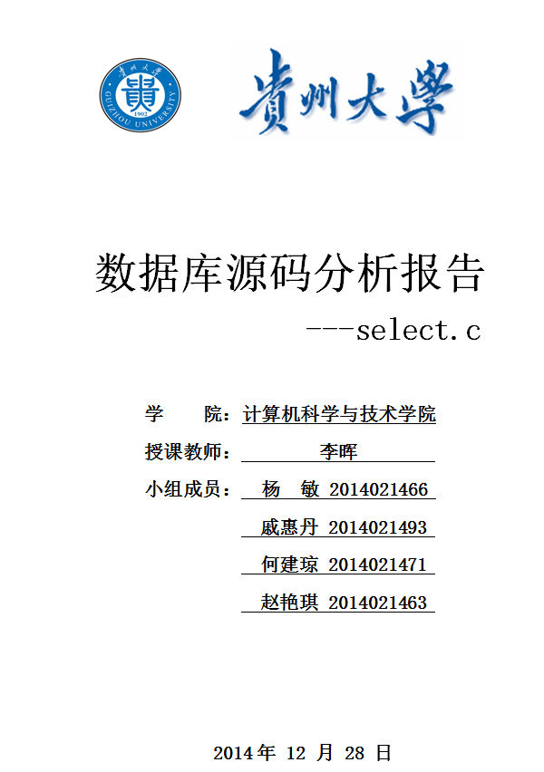
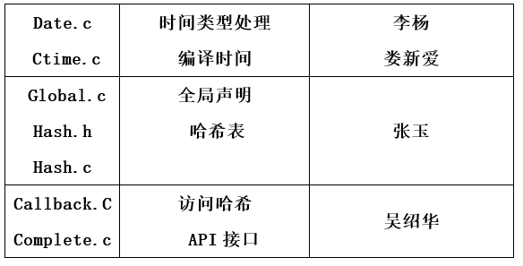

# 小组分工

<table>
   <tr><td>姓名</td><td>分工</td></tr>
   <tr><td>戚惠丹</td><td>从方法clearSelect()到generateColumnTypes()
       （22个函数    1163行）</td></tr>
   <tr><td>何建琼</td><td>从方法generateColumnNames()
到multiSelectOrderBy()
（10个函数    1347行）</td></tr>
   <tr><td>赵艳琪</td><td>	从方法substExpr()到sqlite3SelectExpand()
       （10个函数     954行）</td></tr>
   <tr><td>杨  敏</td><td>	从方法selectAddSubqueryTypeInfo()
到sqlite3ExplainSelect()
       （10个函数     1164行）</td></tr>
</table>
<table><tr><td>学号</td><td>姓名</td><td>工作内容</td></tr>
<tr><td>2014021468</td><td>李政</td><td>从代码开头到IsDistinctIndex函数，共1520行</td></tr>
<tr><td>2014021448</td><td>毕赣斌</td> <td>从IsDistinctRedundant函数到whereInScanEst函数，共1340行</td></tr>
<tr><td>2014021443</td><td>王秀超</td><td> 从bestBtreeIndex函数到4255行，共1364行</td></tr>
<tr><td>2014021449</td><td>滕飞</td><td> 从4257行开始到代码结尾，共1057行</td></tr></table>
<table>
<tr><td>姓名 </td><td>学号</td><td>专业</td><td>阅读源码  </td> </tr>
<tr><td>牛俊洁</td><td>2014021491</td><td>计算机技术   </td><td>update.c</td> </tr>
<tr><td>周放</td><td>2014021489</td><td>计算机技术 </td><td>Printf.c</td> </tr>
<tr><td>仝天乐</td><td>2014021506</td><td>软件工程</td><td>Trigger.c</td> </tr>
<tr><td>廖军 </td><td>2014021451</td><td>计算机应用技术   </td><td>fun.cc,auth.c  </td> </tr>
<tr><td>朱莉娜</td><td>2014021507</td><td>软件工程</td><td>analyze.c  </td> </tr>
<tr><td>刘易</td><td>2014021469</td><td>信息安全</td><td>alter.c  </td> </tr></table>
|学号 | 姓名 | 专业 | 分析代码 |
| -- | -- | -- | -- |
| 2014021477 | 万寅 | 计算机技术 |util.c|
| 2014021513| 朱坤 | 软件工程 | utf.c和vacuum.c|
| 2014021472 | 陈万里 | 信息安全 | vdbemem.c |
| 2014021438 | 王亚伟 |软件与理论|vdbeInt.h和vdbemem.c887行以后|
第四小组数据库源码分析主要分析vdbeaux和vdbesort。  
小组成员：   
李晶  （学号：2014021462）   
				 	陈琦  （学号：2014021499）   
				 	任伟  （学号：2014021511）   
				 	喻群  （学号：2014021520）  
| 姓名 | 学号| 专业 | 阅读代码 |
| -- | -- | -- | -- |
| 管林 | 2014021505 | 软件工程 | 25%|
| 张宇迪 | 2014021496 | 计算机技术 | 25% |
|李慧娟 | 2014021485 | 计算机技术 | 25% |
| 郭艳君 | 2014021479 | 计算机技术 | 25% |
    

  组员：
    侯稀垟         陈路路      张宇            胡伟

1.	SQLite程序系统分析 (王振军)
2.	查询字符串功能(陈金坤)
3.	分词器核心部分（陈功）
4.	哈希表 (关灿)
