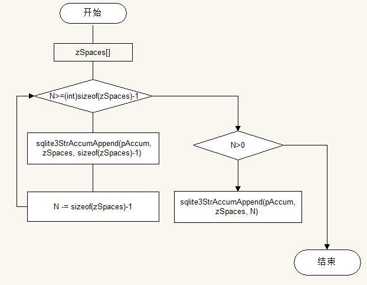

#主要功能
sqlite3AppendSpace()函数
<pre>
void sqlite3AppendSpace(StrAccum *pAccum, int N){
  static const char zSpaces[] = "                             ";
  while( N>=(int)sizeof(zSpaces)-1 ){
    sqlite3StrAccumAppend(pAccum, zSpaces, sizeof(zSpaces)-1);
    N -= sizeof(zSpaces)-1;
  }
  if( N>0 ){
    sqlite3StrAccumAppend(pAccum, zSpaces, N);
  }
}
功能：这个函数用于增加n个空格字符到指定字符串缓冲区
函数引用：
流程图：
</pre>
