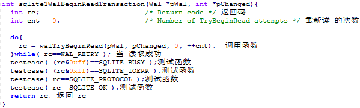
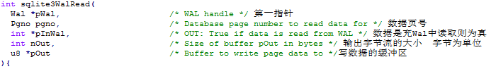
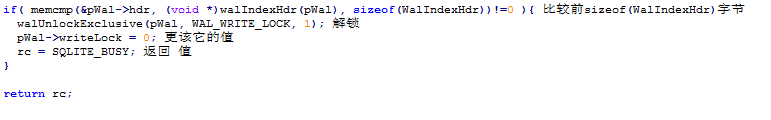
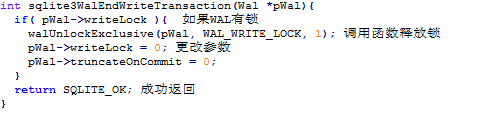

# 读事务
&nbsp;&nbsp;&nbsp;&nbsp;&nbsp;&nbsp;&nbsp;&nbsp;开始一个读事务时，读者记录WAL中最后一个有效的框的索引。读者用myFrame值记录所有的子顺序读操作。新的事务能被添加到WAl中，只要读者使用原始的myFrame值并且忽略新的增加的内容它将看到一个快照。这个技术允许多事务并行读不同的数据库内容。 
 
读算法
&nbsp;&nbsp;&nbsp;&nbsp;&nbsp;&nbsp;&nbsp;&nbsp;从数据库中读一页（假设为页P），读者首先检查WAL来确定是否包含页P，如果包含，那么页P的最后一个有效实例是在该 WAL框中。如果WAl没有包含页P，那么页P就从数据库文件中读入。 
实现算法： 
 
&nbsp;&nbsp;&nbsp;&nbsp;&nbsp;&nbsp;&nbsp;&nbsp;结束读事务：当读事务结束时，调用此方法，释放锁. 
 
**写事务：** 
&nbsp;&nbsp;&nbsp;&nbsp;&nbsp;&nbsp;&nbsp;&nbsp;写事务开始前应该有个一个sqlite3WalBeginWriteTransaction(Wal *pWal)已经被调用开始了一个读事务。
&nbsp;&nbsp;&nbsp;&nbsp;&nbsp;&nbsp;&nbsp;&nbsp;//写事务开启前必须读事务在运行 
 
&nbsp;&nbsp;&nbsp;&nbsp;&nbsp;&nbsp;&nbsp;&nbsp;//同一时间段只有一个写事务允许进行，如果有多个写事务请求，则返回sql_busy. 
 
&nbsp;&nbsp;&nbsp;&nbsp;&nbsp;&nbsp;&nbsp;&nbsp;//如果另一个连接开始了读事务在这个文件上，这个时候是不允许写入的。 
 
&nbsp;&nbsp;&nbsp;&nbsp;&nbsp;&nbsp;&nbsp;&nbsp;写事务的关闭和释放写锁 
 
