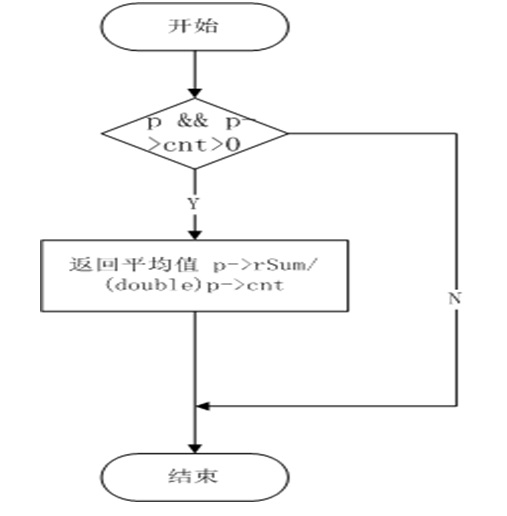

# 集合函数

（1）static void avgFinalize(sqlite3_context *context)

这个函数返回组中值的平均值

（2）工作流程

通过计算总值p->rSum除以组数p->cnt，得到平均值，返回其值

如图为avgFinalize函数实现流程

4.2表达式中所有值的和

（1）函数头

static void sumFinalize(sqlite3_context *context)

返回表达式中所有值的和

（2）工作流程

若给指针变量p和p->cnt>0成立，判断p是否溢出，若溢出，返回错误信息-1，若未溢出，判断p是否为近似值，若是，则返回近似总和rSum。反之，返回整数总和iSum。

如图为sumFinalize函数实现流程

4.3组中项目的数量

（1）函数头

static void countFinalize(sqlite3_context *context)
（2）	工作流程

判断变量p是否存在，若存在，则返回组中项目数量n；若不存在，返回0
