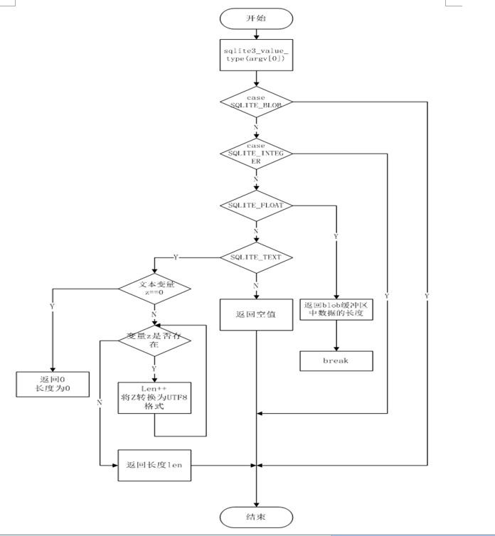

# 字符处理函数
2.1返回给定字符串表达式的字符个数。

（1）函数头

static void lengthFunc( sqlite3_context *context,int argc, sqlite3_value **argv)

返回字符长度

（2）函数实现流程

	字符串表达式如果是SQLITE_BLOB，SQLITE_INTEGER，不输出任何值

	若给定字符串表达式是SQLITE_FLOAT，返回字符串长度

	若给定字符串表达式是SQLITE_TEXT，判断字符串是否为0，若为0 ，则返回长度0如果字符串不为0，返回字符串表达式长度

	若给定字符串表达式与以上都不匹配，则返回空值

如图为lengthFunc函数实现流程

2.2将小写字符数据转换为大写的字符表达式upperFunc

（1）函数头

static void upperFunc(sqlite3_context *context, int argc, sqlite3_value **argv)

返回将小写字符数据转换为大写的字符表达式

（2）函数实现流程

	判断字符串z2是否存在，若存在，给字符串z1分配空间，同时若z1存在，循环z1中的各个字符，将字符串z2的小写字符转换为大写字符赋值给z1

	释放z1，返回字符串z1

2.3将大写字符数据转换为小写字符数据后返回字符表达式lowerFunc

（1）static void lowerFunc(sqlite3_context *context, int argc, sqlite3_value **argv)

返回将大写字符数据转换为小写的字符表达式

（2）函数实现流程

	判断字符串z2是否存在，若存在，给字符串z1分配空间，同时若z1存在，循环z1中的各个字符，将字符串z2的大写字符转换为小写字符赋值给z1

	释放z1，返回字符串z1

如图为lowerFunc函数实现流程

2.4返回表达式的一部分字符串substrFunc

static void substrFunc(sqlite3_context *context,  int argc, sqlite3_value **argv)

substr(x,p1,p2)是返回从p1（字符串中指定起始位置）开始查找x[]的p2（返回的字符串长度）个的字符。所以substr(x,1,1)返回第一个字符x,

如果x是文本,那么我们实际上计算utf - 8字符数。

如果x是一个blob（二进制）,那么我们计数字节。

如果p1是负的,那么我们开始从abs(p1)中x[]尾端算起。例：substr("ABCDEFG", -3,2)，返回EF

如果p2是负的,返回从x[]尾端算起p2个字符。substr("ABCDEFG", 0,-2)，返回FG

2.5确定给定的字符串是否与指定的模式匹配。likeFunc

（1）函数头

static void likeFunc( sqlite3_context *context, int argc,  sqlite3_value**argv)

实现SQL like()函数，这个函数实现了内置的LIKE操作符。函数的第一个参数是模式和第二个参数是字符串。因此SOL语句为 A LIKE B
被实现为like(B,A).同样的功能(不同的compareInfo结构)计算通配符匹配操作符运算符。

（2）	函数实现流程

	给要比较的两个模式zA和zB赋值，限制LIKE模式中zA和zB的长度以避免在patternCompare()里的太复杂

	保持zB编码没有以改变， 转义字符的字符串zEsc必须包括一个单UTF-8字符。 否则，返回一个错误。

	判断模式zA和模式zB是否存在，若存在，进入compareInfo结构定义中做LIKE模式匹配，如果比较的两个比较两个UTF-8字符串相等，返回true,如果他们两个不相等，返回false

