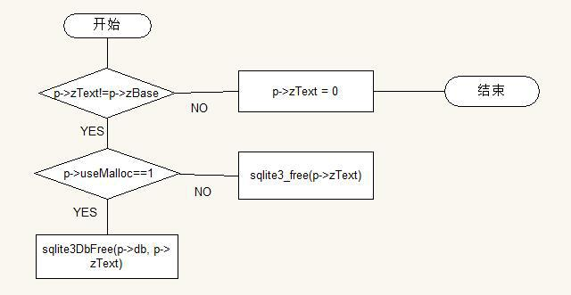

# sqlite3StrAccumReset()函数
<pre>
void sqlite3StrAccumReset(StrAccum *p){
  if( p->zText!=p->zBase ){
    if( p->useMalloc==1 ){
      sqlite3DbFree(p->db, p->zText);
    }else{
      sqlite3_free(p->zText);
    }
  }
  p->zText = 0;
}
功能：这个函数用于重置一个StrAccumulated类型的字符，并且回收所有分配的内存。
流程图:
</pre>
