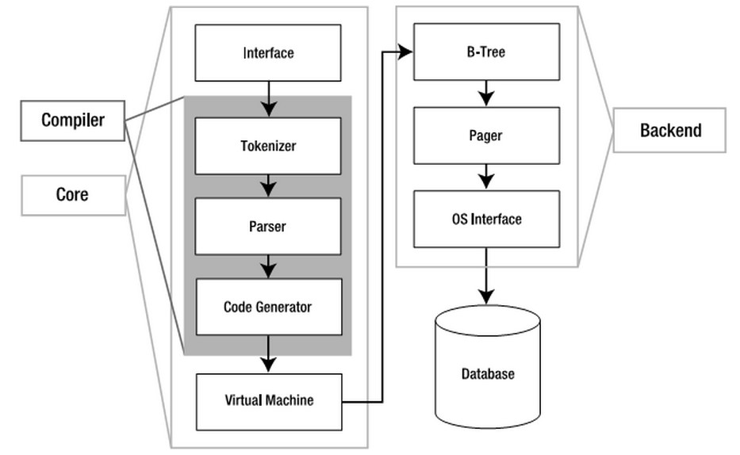

# 1.	SQLite结构
SQLite被组织成了3个子系统分8个独立模块，如下图1-1所示。

##1.1	接口(Interface)
接口由SQLite C API组成，也就是说不管是程序、脚本语言还是库文件，最终都是通过它与SQLite交互的(我们通常用得较多的ODBC/JDBC最后也会转化为相应C API的调用)。
##1.2	编译器(Compiler)

在编译器中，分词器（Tokenizer）和分析器(Parser)对SQL进行语法检查，然后把它转化为底  层能更方便处理的分层的数据结构---语法树，然后把语法树传给代码生成器(code generator)进行处理。而代码生成器根据它生成一种针对SQLite的汇编代码，最后由虚拟机(Virtual Machine)执行。
##1.3	虚拟机(Virtual Machine)

架构中最核心的部分是虚拟机，或者叫做虚拟数据库引擎(Virtual Database Engine,VDBE)。它和Java虚拟机相似，解释执行字节代码。VDBE的字节代码由153个操作码(opcodes)构  成，它们主要集中在数据库操作。它的每一条指令都用来完成特定的数据库操作(比如打开一个表的游标)或者为这些操作栈空间的准备(比如压入参数)。总之，所有的这些指令都是为了满足SQL命令的要求(关于VDBE，后面会做详细介绍)。
##1.4	后端(Back-End)

后端由B-树(B-tree)，页缓存(page cache，pager)和操作系统接口(即系统调用)构成。B-tree和page cache共同对数据进行管理。B-tree的主要功能就是索引，它维护着各个页面之间的复杂的关系，便于快速找到所需数据。而pager的主要作用就是通过OS接口在B-tree和Disk之间传递页面，如图1-2所示。

