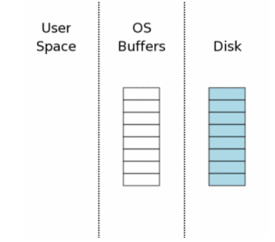
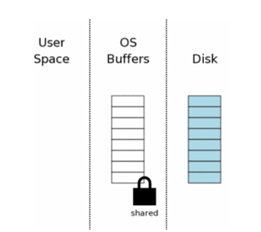
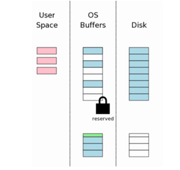
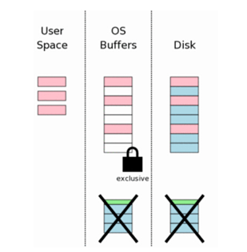

# SQLite在Windows系统上的锁机制实现流程
&nbsp;&nbsp;&nbsp;&nbsp;&nbsp;&nbsp;&nbsp;os_win.c文件中的核心实现在于对数据库锁机制的实现，为了便于进一步理解，下面我将对整个锁机制在windows平台上的实现流程进行分析。

(1)初始状态

&nbsp;&nbsp;&nbsp;&nbsp;&nbsp;&nbsp;&nbsp;当一个数据库第一次打开时计算机的状态示意图如右图所示。图中最右边（“Disk”标注）表示保存在存储设备中的内容。每个方框代表一个扇区。蓝色的块表示这个扇区保存了原始资料。图中中间区域是操作系统的磁盘缓冲区。
在我们的案例开始的时候，这些缓存是还没有被使用—因此这些方框是空白的。图中左边区域显示 SQLite 用户进程的内存。因为这个数据库联 接刚刚打开，所以还没有任何数据记录被读入，所以这些内存也是空的。

(2)申请一个共享锁

&nbsp;&nbsp;&nbsp;&nbsp;&nbsp;&nbsp;&nbsp;SQLite 在可以写数据库之前，它必须先读这个数据库，看它是否已经存在了。为了从数据库文件读取，第一步是获得一个数据库文件的共享锁。一个“共享”锁允许多个数据库联接在同一时刻从这个数据库文件中读取信息。“共享”锁将不允许其他连接针对此数据库进行写操作。
&nbsp;&nbsp;&nbsp;&nbsp;&nbsp;&nbsp;&nbsp;共享锁只是针对操作系统的磁盘缓存，并非磁盘本身。通常文件锁只是操作系统内核的一些标识。因此，锁会立即消失一旦操作系统崩溃或者停电。当然创建该锁的进程消失，该锁也会随之而去。

(3)从数据库里面读取信息

&nbsp;&nbsp;&nbsp;&nbsp;&nbsp;&nbsp;&nbsp;当共享锁取得之后，我们就可以开始从数据库文件中读取信息了。在当前环节，我们已经假定了系统缓存是空的，所以信息必须首先从读硬盘读取到系统缓存中去，然后从系统缓存中传递到用户空间。针对之后的读取，部分或者全部数据都可能可以从操作系统缓存中取得，所以只需要传递到用户空间即可。
&nbsp;&nbsp;&nbsp;&nbsp;&nbsp;&nbsp;&nbsp;一般的，数据库文件只有部分被读取。这个例子中， 8 页中只有 3 页被读取。一个典型应用中，一个数据库文件拥有成千上万页，一个查询通常读取到的页码数量只占总数一个很小的百分比。

(4)申请一个 Reserved Lock

&nbsp;&nbsp;&nbsp;&nbsp;&nbsp;&nbsp;&nbsp;修改一个数据库之前， SQLite 首先得拥有一个针对数据库文件的“Reserved” 锁。 Reserved 锁类似于共享锁，它们都允许其他数据库联接读取信息。单个 Reserved 锁能够与其他进程的多个共享锁一起协作。然后一个数据库文件同时只能存在一个 Reserved 。因此只能有一个进程在某一时刻尝试去写一个数据库文件。
&nbsp;&nbsp;&nbsp;&nbsp;&nbsp;&nbsp;&nbsp;Reserved 锁的存在是宣告一个进程将打算去更新数据库文件，但还没有开始。因为还没有开始修改，因此其他进程可以读取数据，其他进程不应该去尝试修改该数据库。

(5)生成一个回滚日志文件

&nbsp;&nbsp;&nbsp;&nbsp;&nbsp;&nbsp;&nbsp;在修改数据库文件之前， SQLite 会生成一个单独的回滚日志文件，并在其中写进将会被修改的页的原始数据。回滚日志文件意味它将包含了所有可以将数据库文件恢复到原始状态的数据。

(6)修改用户进程中的数据页

&nbsp;&nbsp;&nbsp;&nbsp;&nbsp;&nbsp;&nbsp;当原始的数据已经被保存到回滚日志文件中之后，用户内存的数据就可以被修改了。任何一个数据库连接都有其他私有用户内存空间，所以用户内存空间发生的变化只有当前数据库连接才可见。
&nbsp;&nbsp;&nbsp;&nbsp;&nbsp;&nbsp;&nbsp;其他数据库联接仍然可以读取那些存在于操作系统磁盘缓存中还没有被修改的数据。所以即使一个联接忙于某些修改，其他进程还可以读取原始数据到它们各自的空间中去。

(7)刷新回滚日志文件到存储设备中

&nbsp;&nbsp;&nbsp;&nbsp;&nbsp;&nbsp;&nbsp;接下来的步骤是将回滚日志文件刷新到硬盘中去。接下来我们会看到，这是一个紧要步骤用来保证我们可以从突然掉电中救回数据。这个步骤将要花费大量的时间—因为通常写入到硬盘是一个耗时操作。

(8)获得一个排他锁

&nbsp;&nbsp;&nbsp;&nbsp;&nbsp;&nbsp;&nbsp;在修改数据库文件本身之前，我们必须取得一个针对此数据库文件的排他锁。取得此锁的过程是分二步走的。首先SQLite 取得一个未决锁，然后将此锁提升成一个排他锁。
&nbsp;&nbsp;&nbsp;&nbsp;&nbsp;&nbsp;&nbsp;未决锁的必要性：一个临界锁允许其他所有已经取得一个共享锁的进程从数据库文件中继续读取数据。但是它会阻止新的共享锁的生成。也就说，临界锁将会防止因大量连续的读操作而 无法获得写入的机会。这些读取者可能有一打，也可能上百，甚至于上千。任何一个读取者在开始读取之前都要申请一个共享锁，然后开始读取它需要的数据，然后释放共享锁。然而存在这样一种可能：如果有太多的进程来读取同一个数据文件，在老的进程释放它的共享锁之前总是会有新的进程申请共享锁，因此不会存在某一时刻这个数据库文件上没有共享锁的存在，也因此写入者不会拥有取得一个独享锁的机会。临界锁的概念可以使现有的读取者完成他们的读取，同时阻止新的读取者读取，最后所有的读取者都读完之后，这个临界锁就可以被提升为独享锁了。

(9)将变更写入到数据库文件中

&nbsp;&nbsp;&nbsp;&nbsp;&nbsp;&nbsp;&nbsp;一旦排他锁在手，我们知道再也没有其他进程在读取此数据库文件了，此时修改此文件是安全的了。通常，这些变更只会发生在操作系统磁盘缓存中，并不会全部写入到磁盘中去。

(10)刷新变更到存储

&nbsp;&nbsp;&nbsp;&nbsp;&nbsp;&nbsp;&nbsp;一个附加的 flush 操作是必要的，这样才可以保证针对此文件的变化真正的写入到永久存储器中。这也是一个重要的步骤，将可以保证数据在掉电之后也将是完整无损的。

(11)删除回滚日志文件

&nbsp;&nbsp;&nbsp;&nbsp;&nbsp;&nbsp;&nbsp;当数据变更已经安全的写入到硬盘之后，回滚日志文件就没有必要再存在了，因此立即删除之。如果在删除之前又掉电了或者系统崩溃了，恢复进程（在后面将会提到）会将日志文件的内容写回到数据库文件中—即使这个数据库没有发生变化。如果删除之后系统崩溃或者又停电了，看起来好象所有变化都已经写入到磁盘。因此， SQLite 判断数据库文件是否完成了变更是依赖于回滚日志文件是否存在。

（12）释放锁

&nbsp;&nbsp;&nbsp;&nbsp;&nbsp;&nbsp;&nbsp;事务提交最后一个步骤是释放独享锁，数据库进入未加锁状态，其他进程就又可以立即访问数据库文件了。

