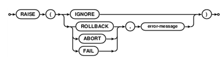

# Trigger简介
SQLite 的触发器是数据库的回调函数，它会自动执行/指定的数据库事件发生时调用。

其中Trigger.c是代码生成器用来生成Trigger语句

	特定的数据库表发生 DELETE、INSERT 或 UPDATE 时触发，或在一个或多个指定表的列发生更新时触发。

	SQLite 只支持 FOR EACH ROW 触发器, 没有 FOR EACH STATEMENT 触发器。FOR EACH ROW：BEGIN后语句可在（由WHEN子句决定的）数据库插入、更改或删除的每一行触发trigger。

	WHEN 子句和触发器动作可访问使用表单 NEW.column-name 和 OLD.column-name 的引用插入、删除或更新的行元素。OLD和NEW引用只在触发器与之相关的trigger-event 处可用，例如：

    INSERT	NEW可用
    UPDATE	NEW和OLD均可用
    DELETE	OLD可用

	BEFORE 或 AFTER 关键字决定何时执行触发器动作，决定是在关联行的插入、修改或删除之前或者之后执行触发器动作。

	当触发器相关联的表删除时，自动删除触发器。

	要修改的表必须存在于同一数据库中，作为触发器被附加的表或视图，且必须只使用 tablename，而不是 database.tablename。

	一个特殊的 SQL 函数 RAISE() 可用于触发器程序内抛出异常。

    raise-function ::=RAISE ( ABORT, error-message ) |
                      RAISE ( FAIL, error-message ) |
                      RAISE ( ROLLBACK, error-message ) |
                      RAISE ( IGNORE )
当触发器程序执行中调用了上述前三个之一的形式时，则执行指定的ON CONFLICT进程（ABORT、FAIL或者ROLLBACK）且终止当前查询，返回一个SQLITE_CONSTRAINT错误并说明错误信息。

当调用RAISE(IGNORE)，当前触发器程序的余下部分，触发该触发器的语句和任何之后的触发器程序被忽略并且不恢复对数据库的已有改变。若触发触发器的语句是一个触发器程序本身的一部分，则原触发器程序从下一步起继续执行。
