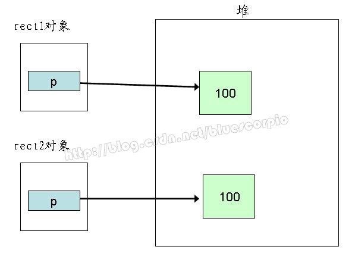

# vdbemem.c(陈万里)
在vdbemem.c中包含了对结构体"Mem"的操作函数。在SQLite内部，vdbe用"Mem"结构来操作几乎所有的SQL值：字符串，整数，实数，二进制数，数据行，函数等等。每个Mem结构代表一个值，而在外部接口用结构体sqlite_value代表Mem结构。

## 3.1.用于形式转化的操作函数 

   Mem结构会给出同一个值的多种表示法(string、integer等)。因此Mem结构有时需要转化为另一种表示方式，如字符串U8转为U16，整数转为实数或二进制数，有时要求提取Mem结构中的值如：返回整数或字符串或者从代表函数的Mem结构中提取出该函数执行后的返回结果。下面的函数执行这些操作：
         int sqlite3VdbeChangeEncoding(Mem *pMem, int desiredEnc)    
         int sqlite3VdbeMemGrow(Mem *pMem, int n, int preserve)
         int sqlite3VdbeMemRealify(Mem *pMem)
         int sqlite3VdbeMemNumerify(Mem *pMem)

## 3.2.下面的函数清除Mem结构的内容：
```

        void sqlite3VdbeMemSetNull(Mem *pMem)
         void sqlite3VdbeMemSetZeroBlob(Mem *pMem, int n)
         void sqlite3VdbeMemSetDouble(Mem *pMem, double val)
         void sqlite3VdbeMemSetRowSet(Mem *pMem)
```

##  3.3.处理两个Mem结构的函数如比较，复制等：

```

        void sqlite3VdbeMemShallowCopy(Mem *pTo, const Mem *pFrom, int srcType)(浅拷贝)
         int sqlite3VdbeMemCopy(Mem *pTo, const Mem *pFrom)(深拷贝)
         void sqlite3VdbeMemMove(Mem *pTo, Mem *pFrom)
         int sqlite3MemCompare(const Mem *pMem1, const Mem *pMem2, const CollSeq *pColl
```

         
附:浅拷贝和深拷贝示意图
  
  
