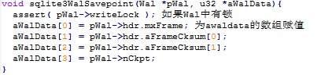

# 保存点
&nbsp;&nbsp;&nbsp;&nbsp;&nbsp;&nbsp;&nbsp;&nbsp;建立保存点，在事务回滚时，如果建立保存点，就会大大降低回滚代价。保存WAL_SAVEPOINT_NDATA的值到aWALData中。 
 
&nbsp;&nbsp;&nbsp;&nbsp;&nbsp;&nbsp;&nbsp;&nbsp;如果有任何数据被写入（但不提交）到日志文件中，该函数移动写指针返回到事务的开始。此外，该函数被用来调用事务使数据到WAL每一帧。如果回调函数不返回SQLITE_OK,它不会被再次调用，并且错误代码返回给调用者。否则，如果回调函数不返回一个错误，这个函数返回SQLITE_OK。 
 
&nbsp;&nbsp;&nbsp;&nbsp;&nbsp;&nbsp;&nbsp;&nbsp;恢复WAL索引头的状态，iframe是在客户端开始写入到数据库之前的客户端缓存。 
 
