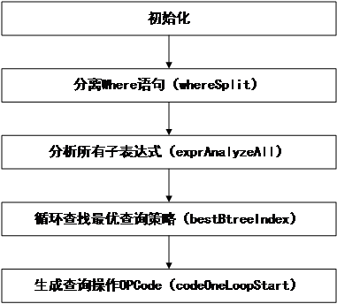

# sqlite3WhereBegin函数

sqlite3WhereBegin函数中调用exprAnalyzeAll分析Where语法树，嵌套循环调用bestBtreeIndex函数计算每种查询策略代价，选取最优代价的策略生成VDBE OPCode。

    WhereInfo *sqlite3WhereBegin(
        Parse *pParse,        /* 语法分析器上下文 */
        SrcList *pTabList,    /* 需要被扫描的table列表 */
        Expr *pWhere,         /* Where语法树 */
        ExprList **ppOrderBy, /* Order By 语法树 */
        ExprList *pDistinct,
        u16 wctrlFlags,
        int iIdxCur )

为返回值WhereInfo初始化及分配内存空间，一次分配WhereInfo中的a[]、WhereClause及WhereMaskSet。

    db = pParse->db;
    nByteWInfo = ROUND8(sizeof(WhereInfo)+(nTabList-1)*sizeof(WhereLevel));
    pWInfo = sqlite3DbMallocZero(db,
        nByteWInfo +
        sizeof(WhereClause) +
        sizeof(WhereMaskSet)
    );
初始化WhereClause，调用whereSplit函数进行分解Where语句中以AND操作符分割的子语句。

    initMaskSet(pMaskSet);
    whereClauseInit(pWC, pParse, pMaskSet, wctrlFlags);
    sqlite3ExprCodeConstants(pParse, pWhere);
    whereSplit(pWC, pWhere, TK_AND);   /* IMP: R-15842-53296 */

调用exprAnalyzeAll函数分析所有的子表达式，处理前面查询语句的几种查询优化处理方法，例如BETWEEN、同属性多个OR连接、LIKE语句等的处理。

    exprAnalyzeAll(pTabList, pWC);

开始查询优化，初始化查询优化中使用的变量，比如保存已发现的代价最小的查询策略。

    WHERETRACE(("*** Optimizer Start ***\n"));
    for(i=iFrom=0, pLevel=pWInfo->a; i<nTabList; i++, pLevel++){
        WhereCost bestPlan;         /* 保存已发现的最高效的查询计划 */
        Index *pIdx;                /* pTabItem中FROM表中的索引 */
        int j;                      /* 循环FROM表 */
        int bestJ = -1;             /* The value of j */
        Bitmask m;                  /* Bitmask value for j or bestJ */
        int isOptimal;              /* 迭代最优/非最优查询 */
        int nUnconstrained;         /* 未被索引的表的数量 */
        Bitmask notIndexed;         /* 位掩码，显示不能使用索引的表 */
        memset(&bestPlan, 0, sizeof(bestPlan));  /* 清零最优查询计划bestPlan */
        bestPlan.rCost = SQLITE_BIG_DBL;  /* 将最优查询计划的代价值设为最大 */
        WHERETRACE(("*** Begin search for loop %d ***\n", i));

计算对当前循环的表查询策略的代价，通过分析能否使用索引、记录数量、排序等因素估算查询开销代价。

    WHERETRACE(("=== trying table %d with isOptimal=%d ===\n",j, isOptimal));
    if( IsVirtual(pTabItem->pTab) ){
        sqlite3_index_info **pp = &pWInfo->a[j].pIdxInfo;
        bestVirtualIndex(pParse, pWC, pTabItem, mask, notReady, pOrderBy, &sCost, pp);
    }else
    {
        bestBtreeIndex(pParse, pWC, pTabItem, mask, notReady, pOrderBy,pDist, &sCost);
    }

检查嵌套循环扫描的表是否有INDEXED BY语句，以及命名索引是否在扫描中使用。如果没有则查询编译失败，返回错误信息。

    pIdx = pTabList->a[bestJ].pIndex;
    if( pIdx ){
        if( (bestPlan.plan.wsFlags & WHERE_INDEXED)==0 ){
            sqlite3ErrorMsg(pParse, "cannot use index: %s",pIdx->zName);
            goto whereBeginError;
        }else{assert( bestPlan.plan.u.pIdx==pIdx );
        /* 优化结束 */
    WHERETRACE(("*** Optimizer Finished ***\n"));

打开所有pTabList中的表和所有表用于查询的索引，生成打开表的OPCode以及打开索引的OPCode。

    for(i=0, pLevel=pWInfo->a; i<nTabList; i++, pLevel++){
        Table *pTab;     /* 待打开的表 */
        int iDb;         /* 包含表和索引的数据库索引 */
        ……
        int op = pWInfo->okOnePass ? OP_OpenWrite : OP_OpenRead;
        sqlite3OpenTable(pParse, pTabItem->iCursor, iDb, pTab, op);
        ……
        int iIndexCur = pLevel->iIdxCur;
        sqlite3VdbeAddOp4(v, OP_OpenRead, iIndexCur, pIx->tnum, iDb,(char*)pKey, P4_KEYINFO_HANDOFF);

调用codeOneLoopStart函数，生成查询处理OPCode，针对for循环中的每次迭代生成单个虚拟机程序的嵌套循环，并且根据优化分析得到的结果针对5种查询策略生成每层循环不同的OPCode。

    notReady = ~(Bitmask)0;
    for(i=0; i<nTabList; i++){
        pLevel = &pWInfo->a[i];
        explainOneScan(pParse, pTabList, pLevel, i, pLevel->iFrom, wctrlFlags);
        notReady = codeOneLoopStart(pWInfo, i, wctrlFlags, notReady);
        pWInfo->iContinue = pLevel->addrCont;
    }

